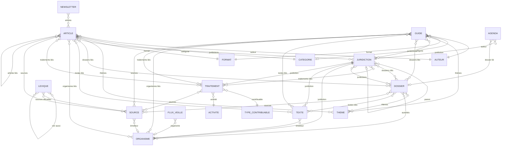
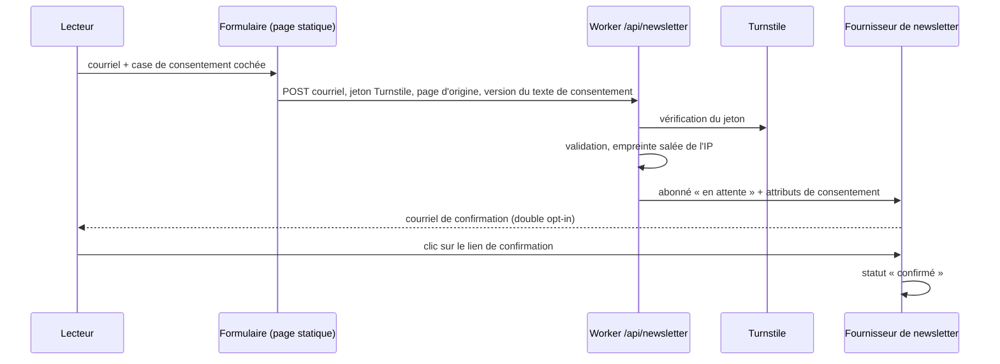
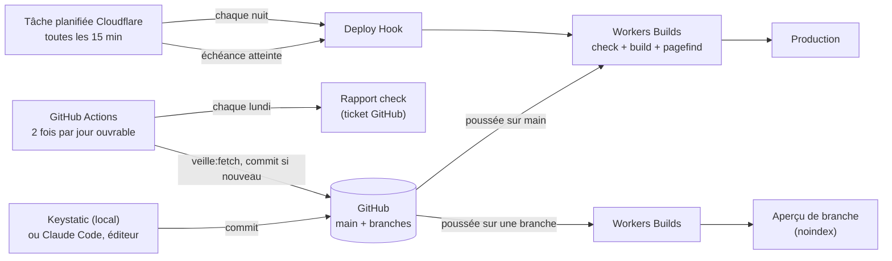

# Architecture

> Phase 0, livrable 1 sur 3, rédigé le 25 septembre 2026; tenu à jour jusqu'à la phase 5 (28 septembre 2026).
> Statut : validé par l'auteur (`docs/QUESTIONS.md`); décisions de chaque phase en section 25.
> Référence : brief v2. Quand ce document s'en écarte, l'écart est signalé et justifié (section 25).
> Convention : les faits tirés d'extraits de moteur de recherche, non recoupés sur une source primaire, sont marqués « (s) ». Les sites de la plupart des fournisseurs étaient inaccessibles depuis l'environnement de travail (section 26).

---

## Sommaire

0. Lexique technique
1. Résumé
2. Hypothèses de travail
3. Famille A contre famille B
4. Interface d'édition dans la famille A
5. Pile retenue et versions vérifiées
6. Arborescence
7. Modèle de contenu
8. Architecture des URL
9. Rendu, composition et fraîcheur
10. Recherche
11. Newsletter
12. Formulaires, anti-pourriel, analytique, données de marché
13. Référencement
14. Veille officielle
15. Déploiement et publication programmée
16. Sécurité, sauvegarde, comptes et secrets
17. Données personnelles et conformité : mécanismes
18. Coûts mensuels estimés
19. Risques et parades
20. Décisions irréversibles
21. Ce qui doit être prévu dès la v1
22. Feuille de route v1, v2, v3
23. Chemin de migration de A vers B
24. Estimation d'effort par phase
25. Écarts avec le brief et décisions prises par défaut
26. Journal des vérifications
27. Audit de la phase 5 : performance et accessibilité

---

## 0. Lexique technique

| Terme | Sens dans ce document |
|---|---|
| **Build** (construction du site) | Étape automatique qui transforme les fichiers de contenu en pages web. Si une règle n'est pas respectée, le build échoue et rien n'est mis en ligne : la version précédente reste en place. |
| **Déploiement** | Mise en ligne du résultat d'un build. |
| **Commit** | Enregistrement horodaté et attribué d'une modification dans l'historique Git. |
| **Branche**, **fusion** | Version de travail parallèle; intégration de cette version dans `main`, la branche publiée. |
| **Demande de fusion** (PR) | Proposition de fusion soumise à relecture sur GitHub. |
| **Aperçu de branche** | Copie du site construite à partir d'une branche, à une adresse non référencée par les moteurs. |
| **Slug** | Dernière partie de l'adresse d'une page (`/articles/mon-slug/`), qui sert aussi d'identifiant du contenu. |
| **Schéma** (Zod) | Liste des champs attendus d'un contenu et de leurs règles. Un contenu non conforme fait échouer le build avec un message en français. |
| **Worker** | Petit programme exécuté par Cloudflare à la demande (formulaires) ou à heure fixe (tâche planifiée). |
| **Tâche planifiée** (cron) | Action lancée automatiquement à intervalle régulier. |
| **Deploy Hook** | Adresse secrète qui, appelée, déclenche un nouveau build. |
| **Redirection 301** | Renvoi permanent d'une ancienne adresse vers la nouvelle, reconnu par les moteurs. |
| **`noindex`**, **canonique** | Consigne demandant aux moteurs de ne pas référencer une page; adresse officielle d'une page quand plusieurs y mènent. |
| **Îlot** | Petite portion de page qui exécute du JavaScript (menu, recherche) dans une page par ailleurs statique. |
| **Double opt-in** | Inscription confirmée par un clic dans un courriel de vérification. |
| **CSP** | Politique de sécurité du contenu : liste des sources de scripts et d'images que le navigateur accepte. |
| **SDK** | Trousse de développement fournie par un service pour appeler son API. |
| **UTC** | Temps universel coordonné, heure de référence des serveurs (Montréal : UTC−5 l'hiver, UTC−4 l'été). |

---

## 1. Résumé

**Recommandation : famille A** (site statique, contenu dans Git), dans une version volontairement dépouillée :

- **Astro 7** génère un site **entièrement statique**, sans adaptateur serveur au lancement.
- **Un seul petit Worker Cloudflare** (un fichier d'une centaine de lignes) porte ce qui ne peut pas être statique : l'inscription à la newsletter, le formulaire de contact et la tâche planifiée de publication.
- **Le contenu** vit dans le dépôt, en MDX et JSON, sous `content/` et `config/`. Des schémas Zod le valident au build, avec des messages d'erreur en français.
- **Keystatic** sert de formulaire d'édition, en mode local (sur l'ordinateur de l'auteur) au lancement. Le mode en ligne sur `/keystatic` prévu par le brief est documenté et prêt à activer (question A2). C'est un outil remplaçable : il écrit les mêmes fichiers que ceux qu'on éditerait à la main.
- **L'hébergement** se fait sur Cloudflare Workers, forfait gratuit : fichiers statiques gratuits et illimités, aperçus par branche, tâches planifiées.
- **La publication programmée** est déclenchée par Cloudflare toutes les 15 minutes quand une échéance est atteinte. La latence visée est d'une dizaine de minutes en moyenne et d'une vingtaine au pire, sans garantie écrite de Cloudflare; elle sera mesurée après la mise en ligne (phase 5). **La veille officielle** et le rapport hebdomadaire passent par GitHub Actions, dont les retards sont ici sans conséquence.
- **La recherche** repose sur Pagefind, un index statique sans serveur.
- **La newsletter** passe par un fournisseur derrière une interface unique, avec double opt-in natif et preuve de consentement enregistrée chez le fournisseur.

**Pourquoi A.**
- **C'est la condition posée par le brief.** L'auteur est seul et publie quelques fois par semaine : c'est exactement le cas où le point 5.3 retient la famille A.
- **Presque rien à exploiter.** Le coût est proche de zéro, il n'y a ni base de données ni serveur, la sauvegarde se résume à un `git clone`, et le contenu reste lisible sans aucun outil.
- **Des faiblesses connues, non bloquantes pour un auteur seul.** Pas de rôles, une publication programmée émulée, un aperçu par déploiement et non instantané (section 3).
- **Le choix n'enferme pas.** Le passage à B reste possible par script (section 23).

**Ce que l'auteur doit trancher d'abord** : les questions 2 (contributeurs et relecture, décisive pour A ou B), 6 (URL), 1 (nom et domaine), 3 (hébergeur) et 4 (newsletter). Voir `docs/QUESTIONS.md`.

---

## 2. Hypothèses de travail

| Hypothèse | Conséquence si elle est fausse |
|---|---|
| Un seul auteur pendant 12 mois, quelques publications par semaine | Plusieurs contributeurs avec relecture obligatoire : B devient raisonnable (question 2) |
| La publication programmée tolère une vingtaine de minutes de décalage | Publication à la minute près exigée : famille B (section 15.3) |
| Volume à trois ans : moins de 3 000 contenus et moins de 2 000 images | Au-delà : builds incrémentaux, images hors dépôt (section 19) |
| Trafic de 0 à 10 000 visiteurs par jour | Au-delà, le statique tient sans effort; seules les fonctions sont à surveiller |
| Budget d'exploitation proche de zéro, aucun service payant sans accord | Chaque service payant est signalé avec son palier gratuit |
| L'auteur est à l'aise avec Git et Claude Code, mais pas développeur | La maintenance du code passe par Claude Code guidé par `CLAUDE.md` |
| Dépôt GitHub privé (il l'est) | S'il devenait public : l'historique complet, brouillons compris, le serait pour toujours (section 20) |

---

## 3. Famille A contre famille B

### 3.1 Comparaison sur les critères du point 5.3

| Critère | A : Astro + Keystatic + Git | B : Next.js + Payload + PostgreSQL |
|---|---|---|
| Administration par un non-technicien | Formulaires Keystatic aux libellés français, mais habillage de l'outil (boutons, menus) à moitié anglais. Pas de tableau de bord. En mode local, « Sauvegarder » écrit les fichiers; l'envoi sur GitHub (commit) se fait ensuite, avec GitHub Desktop. | Administration complète et traduite en français, tableau de bord, boutons « Publier » et « Programmer ». Nettement plus confortable. |
| Contrôle du code | Total : tout est dans le dépôt. | Total avec Payload (code ouvert, dans le dépôt). |
| Contenu structuré et relations | Bon : schémas Zod, relations validées au build, relations inverses calculées au build. Les relations reposent sur le slug : un renommage casse la référence, mais le build le détecte et le signale. | Excellent : relations par identifiant, intégrité en base, requêtes. |
| Référencement | Excellent : HTML statique, très rapide, rien à régler côté serveur. | Excellent si le rendu statique ou incrémental est bien réglé; plus de risques de régression de performance. |
| Versions et historique | Git : historique complet, différences ligne à ligne, restauration par commit. Peu lisible sans l'interface de GitHub. | Versions natives dans l'administration, restauration en un clic. |
| Brouillons et aperçu | Statut « brouillon » + aperçu instantané sur l'ordinateur de l'auteur (mode local), ou aperçu de branche en ligne après un build de 2 à 5 minutes. | Brouillons natifs, aperçu en direct instantané. |
| Publication programmée | Émulée : date future filtrée au build, build déclenché par une tâche planifiée Cloudflare. Environ 10 minutes de latence en moyenne, 20 au pire. | Native, à la minute près, mais exige un exécuteur de tâches. |
| Médias | Images dans le dépôt, optimisées au build. Le dépôt grossit (environ 150 Mo pour 500 images sources). | Médiathèque, stockage objet (R2 ou S3), recadrage. |
| Recherche | Pagefind, gratuit et sans serveur. | Requêtes en base, Pagefind ou service tiers. |
| Extensibilité | Limitée pour le dynamique (comptes, commentaires, espace membre). | Grande : API, crochets, comptes, rôles. |
| Coût mensuel (0 / 1 000 / 10 000 visiteurs par jour), hors domaine et newsletter | 0 / 0 à 20 / 20 $ US (analytique au-delà du quota gratuit; section 18) | environ 20 / 20 à 40 / 40 à 60 $ US (s) (section 18) |
| Exploitation par une personne seule | Très faible : pas de serveur, pas de base, pas de correctifs de système. Mises à jour d'Astro environ deux fois par an. | Moyenne à élevée : base à sauvegarder et restaurer, migrations de schéma, correctifs de sécurité fréquents, surveillance. |
| Portabilité du contenu | Maximale : fichiers MDX et JSON lisibles par n'importe quel outil. | Export nécessaire (base, API). |

### 3.2 Dans la famille B : Payload, Sanity ou Strapi

État vérifié le 25 septembre 2026 (registre npm, dépôts et documentation sur GitHub). Les sites commerciaux (payloadcms.com, sanity.io, strapi.io, vercel.com) étaient inaccessibles. Next.js, cadre commun aux trois options, est en **16.3.6** (22 septembre 2026, aucune version 17 publiée).

| Critère | **Payload 3.x** | Sanity (Studio v6) | Strapi 5 |
|---|---|---|---|
| Version | 3.90.2 (23 sept. 2026); **4.0 en préversion** (canary 37, 24 sept. 2026) avec changements incompatibles : Node 24.15, Next 16.2.6 et TypeScript 6 minimum, versions actives partout | 6.16.0 (22 sept. 2026); trois majeures en 11 mois (v4 juillet 2025, v5 décembre 2025, v6 juin 2026) | 5.55.1 (24 sept. 2026) |
| Modèle | code ouvert (MIT), s'exécute dans Next.js, base PostgreSQL, SQLite ou MongoDB; racheté par Figma en juin 2025 (engagement de rester open source) | Studio ouvert (MIT), **données dans le « Content Lake » propriétaire** (hébergé en Belgique selon des sources communautaires) | code ouvert (MIT hors `ee/`), serveur Node permanent + base |
| Administration en français | oui (fr-FR) | oui (paquet `locale-fr-fr`) | oui |
| Contenu structuré et relations | relations natives entre collections | références entre documents | relations natives |
| Référencement, recherche | identiques pour les trois : ils dépendent du site Next.js construit devant | | |
| Médias | adaptateurs officiels S3, R2, Vercel Blob; recadrage par sharp | ressources dans le Content Lake; export « avec pertes » selon la documentation | médiathèque intégrée [À VÉRIFIER] |
| Brouillons, versions | natifs, historique et restauration | natifs | brouillon et publication gratuits; historique réservé au forfait Growth |
| Publication programmée | native, mais **exige un exécuteur de tâches** : sans lui, « les publications programmées ne seront jamais exécutées ». Sur Vercel gratuit, tâche planifiée quotidienne seulement (s), donc jusqu'à 24 h de retard sauf déclencheur externe | réservée aux forfaits payants depuis novembre 2025 (s) | « Releases » réservées au forfait Growth, environ 45 $ US par mois (s), ou greffon communautaire |
| Aperçu en direct | oui | oui | forfait Growth |
| Migrations de schéma | **obligatoires en production** à chaque modification du modèle (PostgreSQL et SQLite) | non (schéma côté Studio) | automatiques |
| Sécurité récente | **au moins 27 avis de sécurité du 18 au 22 septembre 2026, dont au moins 6 critiques** (injections SQL, exécution de code à distance, contournements d'accès); 37 des 38 avis du dépôt datent de 2026 | service géré | 2 avis critiques en mai 2026 |
| Extensibilité | élevée (crochets, points d'accès, greffons) | élevée (API, Studio personnalisable) | élevée (greffons) |
| Exploitation par une personne seule | **élevée** : migrations SQL, exécuteur de tâches, correctifs à appliquer ensemble avec Next.js (Payload impose des versions précises de Next.js) | faible côté contenu (service géré), mais site Next.js à héberger et service propriétaire | **élevée** : serveur Node permanent et base à sauvegarder |
| Portabilité | JSON Lexical en base; convertisseurs officiels Markdown ↔ Lexical | export NDJSON; format de texte riche propriétaire (Portable Text) | export de base |
| Coût 0 / 1 000 / 10 000 visiteurs par jour (hors newsletter et analytique) | 20 / ~20 / 20 à 45 $ US (Vercel Pro (s), Neon, R2) | 0 à 35 $ US aux trois paliers (forfait gratuit sans publication programmée, ou Growth à 15 $ US par siège (s), plus l'hébergement du site) | 18 à 65 $ US ou plus (serveur, base, licence Growth éventuelle) (s) |

Directus est écarté : sa licence a changé en 2026 (licence « Sustainable Core » avec clé obligatoire depuis la v12).

**Verdict dans la famille B : Payload**, sur Vercel Pro + Neon (PostgreSQL) + Cloudflare R2. C'est le seul des trois dont le code et les données restent entièrement chez soi. La variante tout Cloudflare (Workers payant, D1, R2, environ 5 $ US par mois) repose sur un adaptateur D1 encore en bêta et sans redimensionnement d'images : trop jeune pour une personne seule.

**Ce que la famille B coûterait vraiment à l'auteur.** L'argent pèse peu (20 à 45 $ US par mois), la charge d'exploitation beaucoup. Il faudrait :
- appliquer vite, et ensemble, les correctifs de Payload et de Next.js;
- maîtriser les migrations SQL;
- faire tourner un exécuteur de tâches;
- sauvegarder la base;
- migrer vers Payload 4 dans les prochains mois.

C'est incompatible avec la consigne « simple et très maintenable par une personne seule », tant que les besoins de la question 2 ne l'imposent pas.

### 3.3 Règle de décision appliquée

Le brief pose la règle : auteur seul pendant 12 mois et quelques publications par semaine, donc A. Plusieurs contributeurs, un relecteur juridique, un circuit de validation ou une publication à l'heure près dès la v1 : B devient raisonnable. Avec les hypothèses de la section 2, **A l'emporte**. La question 2 permet de le confirmer.

Deux points pèsent en faveur de A au-delà de la règle :

1. **La traçabilité prime sur le confort d'édition.** Un média juridique vit de sa fiabilité. Dans A, chaque modification est un commit horodaté et attribué à son auteur, restaurable et comparable ligne à ligne. Les commits ne sont signés cryptographiquement que si la signature est activée, ou lorsque GitHub les crée en ligne. Cet historique peut servir de trace pour la politique de correction; sa valeur probante reste à apprécier par l'auteur.
2. **La pièce la plus coûteuse de B, la base de données, n'apporte rien au lecteur.** Tout ce que le lecteur voit peut être calculé à l'avance.

---

## 4. Interface d'édition dans la famille A

### 4.1 Candidats

État vérifié le 25 septembre 2026 : registre npm, dépôts GitHub et sources de la documentation. Les sites keystatic.com et sveltiacms.app étaient inaccessibles.

| Critère | **Keystatic** | Sveltia CMS | Decap CMS | TinaCMS | Pages CMS |
|---|---|---|---|---|---|
| Version, activité | `@keystatic/core` 0.6.9 (26 août 2026), `@keystatic/astro` 6.0.0 (18 août 2026). 13 versions en 12 mois, mais **aucune pendant 8 mois** (juillet 2025 à mars 2026). Un seul développeur actif. | 0.221.0 (24 sept. 2026), très actif, un seul mainteneur, pas encore de 1.0 | 3.16.3 (22 sept. 2026), actif | 3.14.1, intégration Astro créée en mai 2026 | actif |
| Compatible Astro 7 | oui (dépendance paire `astro 5 \|\| 6 \|\| 7`) | indépendant du cadriciel | indépendant | oui (`@tinacms/astro` 0.7) | indépendant |
| Éditeur MDX à composants | **oui** : blocs, enveloppes, éléments en ligne, marques, chacun avec son formulaire | non : Markdown + composants par expressions régulières | non | oui (édition visuelle) | MDX édité comme du code |
| Relations entre contenus | par slug (`relationship`, `multiRelationship`) | oui, avec rétroliens (s) | oui | oui | limitées |
| Interface en français | libellés, aides et options personnalisables; messages de validation anglais autour du libellé français, sauf ceux des motifs; **habillage à moitié anglais** (locale `fr-FR` seulement, 27 chaînes traduites, dont des contresens visibles en mode GitHub) | environ 89 % traduite | locale `fr` disponible | non traduisible | non |
| Authentification en ligne | GitHub App (3 secrets) ou Keystatic Cloud | jeton personnel (seul auteur) ou relais OAuth | relais OAuth | TinaCloud ou serveur avec **base de données** | service hébergé tiers ou Next.js + PostgreSQL |
| Coût | gratuit (Cloud facultatif, gratuit jusqu'à 3 utilisateurs) | gratuit | gratuit | TinaCloud payant au-delà de 2 utilisateurs (s) | version hébergée : conditions non vérifiées |
| Limites relevées | pas de champ couleur; `datetime` enregistre l'heure locale comme de l'UTC; notes de bas de page détruites à l'enregistrement; bogue ouvert sur les images par URL externe; aucun aperçu en direct pour Astro; pas de publication programmée ni de rôles | 0.x, un seul mainteneur | pas de MDX | exige un serveur | pas d'éditeur à composants |

**Verdict.** Keystatic reste le meilleur choix pour ce projet, grâce à son éditeur MDX à composants, indispensable pour les blocs riches du point 6.15. Sa fragilité est réelle mais bornée : le contenu reste en fichiers standard validés par Zod, et Keystatic n'est qu'un formulaire au-dessus.

**Plans de repli** documentés :
- Sveltia CMS, qui lit un modèle proche et offre une interface française à 89 %, avec les blocs riches à réécrire en composants d'éditeur;
- l'édition directe des fichiers avec Claude Code, qui connaît le modèle par `CLAUDE.md`.

### 4.2 Deux modes d'utilisation de Keystatic

1. **Mode local (recommandé au lancement).** L'auteur lance `npm run dev`, édite dans `http://127.0.0.1:4321/keystatic` et voit le rendu immédiatement dans la page du site. Il enregistre ensuite un commit et le pousse avec GitHub Desktop, le terminal ou Claude Code. Rien de Keystatic n'est déployé : pas de secret, pas de route serveur, pas de compte supplémentaire. C'est aussi le meilleur aperçu, puisqu'en mode en ligne les images n'apparaissent pas dans l'aperçu d'une branche non fusionnée (anomalie ouverte n° 1459).
2. **Mode GitHub (prévu par le brief, activable à la demande).** `/keystatic` devient accessible sur le site, avec une authentification par GitHub : seuls les comptes ayant un accès en écriture au dépôt peuvent éditer, et chaque enregistrement est un commit sur une branche ou sur `main`. Activer ce mode demande :
   - une GitHub App, créée en local;
   - trois secrets chez l'hébergeur (lus à l'exécution) et la variable publique `PUBLIC_KEYSTATIC_GITHUB_APP_SLUG` (lue au build);
   - l'URL de rappel déclarée dans l'App;
   - l'adaptateur `@astrojs/cloudflare`, pour rendre les routes `/keystatic` et `/api/keystatic` à la demande;
   - des en-têtes de sécurité posés par un intergiciel (le fichier `_headers` ne s'applique pas aux réponses produites par du code).

   Compter une demi-session de travail le jour où l'auteur veut éditer depuis un autre appareil (question A2). Revenir au mode local tient en une ligne de configuration.

**Vérifié en phase 3** : l'éditeur local fonctionne avec `astro dev` sans adaptateur. Une intégration (`src/lib/editor-integration.ts`) ajoute React et Keystatic sous `astro dev` seulement : le build de production reste entièrement statique, sans React ni route rendue à la demande. Elle ajoute la barre oblique finale qu'exige le site (`trailingSlash: 'always'`) aux seules adresses de l'éditeur, et désactive l'éditeur si le serveur est ouvert au réseau (`--host`) ou joignable sous un autre nom (`--allowedHosts`), puisque l'API locale écrit sans authentification.

### 4.3 Garde-fous retenus

Vérifiés en phase 3 dans le code de Keystatic 0.6.9 et par des essais (étude du 28 septembre 2026).

- **Les schémas Zod restent la source de vérité**; la configuration de l'éditeur (`src/lib/editor/`) en est le miroir, clé pour clé. Keystatic refuse d'ouvrir un fichier qui porte une clé qu'il ne connaît pas : une clé Zod absente du formulaire se voit donc tout de suite. Les clés que l'auteur ne doit pas modifier (`lang`, `translationKey`, `locale`, `doubleOptIn`…) sont déclarées `fields.ignored()`, conservées telles quelles.
- **Test d'aller-retour** (`tests/editor.test.ts`) : chaque fichier de `content/` et de `config/` est ouvert puis enregistré avec les fonctions mêmes de l'éditeur (`src/lib/editor/roundtrip.ts`), sans navigateur. Il doit s'ouvrir, passer la validation de l'éditeur, garder les mêmes données pour Zod et le même rendu (arbre produit par l'analyseur MDX du site), et ressortir identique à l'octet près. Un enregistrement réel dans l'éditeur a produit exactement le fichier attendu.
- **Format canonique** : tout le contenu est déjà au format qu'écrit l'éditeur (entête YAML de `js-yaml` sans option, JSON indenté de deux espaces, clés dans l'ordre du formulaire, texte réécrit à la façon de l'éditeur : puces `*`, `\[` devant un crochet, blocs indentés). Un premier enregistrement ne change donc rien. `npm run content:format` rétablit ce format après une modification faite à la main; il refuse un fichier dont l'aller-retour changerait les données (lues par Zod), le rendu (arbre de l'analyseur MDX) ou les images, et en donne la raison (`src/lib/editor/compare.ts`, partagé avec le test).
- **Valeurs vides** : une date, un nombre, une adresse ou une relation facultatifs vides sont omis du fichier (Keystatic refuse d'enregistrer une date `''`); un texte vide est omis; une liste fermée facultative a une option vide `''`, pour ne jamais inventer de valeur (un statut réglementaire, par exemple).
- **Corps MDX** : les champs des blocs sont des textes, et Keystatic ne relit dans un attribut ni nombre (même positif), ni `true` ou `false`, ni attribut sans valeur, ni calcul, ni variable; ni HTML, ni commentaire, ni expression `{…}`; ni un bloc englobant écrit sur une seule ligne, ni un autre bloc placé dans un paragraphe. Les montants et les nombres s'écrivent donc en texte (`"-6000"`, `"6"`), et le script `check` signale ces constructions (« Contenus que l'éditeur ne pourrait pas ouvrir »). Une note dans une définition serait déplacée, deux notes collées fusionnées et l'alignement des colonnes d'un tableau retiré : signalé aussi. `check` valide en outre les propriétés littérales des blocs (listes, dates, montants) comme au rendu : un bloc vide ou mal formé ne peut plus arrêter le build au rendu de la page.
- **Pas de note de bas de page `[^1]`**, que l'éditeur transforme en texte ou en lien : composant `Note`, numéroté au rendu (section 7.15). `check` la signale.
- **Images** : l'éditeur ne retrouve une image que dans le dossier de l'entrée, `content/images/<collection>/<identifiant>/`, et nomme une image de champ d'après le champ (`cover/src.webp`). Une image rangée ailleurs serait effacée sans prévenir au premier enregistrement, une image de champ nommée autrement renommée : `check` le signale. Les images Markdown (``) sont proscrites, remplacées par le bloc `Image`.
- **Versions de Keystatic épinglées exactement**, sans plage `^`, et mises à jour dans une branche dédiée : le test d'aller-retour s'appuie sur des fonctions internes, cherchées par leur nom, et échoue clairement si elles changent.
- **Keystatic reste remplaçable.** Son README se déclare toujours « expérimental » et le paquet reste en 0.x.
- **Pas de champ `datetime` Keystatic**, qui enregistre l'heure saisie comme de l'UTC. On utilise un champ date et une heure choisie dans une liste, interprétées dans le fuseau America/Toronto (section 7.1).
- **Couleurs** : Keystatic n'a pas de champ couleur. Les catégories choisissent un style de puce dans une liste fermée (section 7.13), et la palette elle-même se règle par des champs hexadécimaux validés. Le script `check` vérifie ensuite les contrastes.
- **Modifications concurrentes** : l'éditeur garde dans le navigateur les modifications non enregistrées et les réapplique au fichier, même modifié entre-temps (un simple message anglais le signale). Règle dans `CLAUDE.md` et le guide : une seule source de modifications à la fois.

---

## 5. Pile retenue et versions vérifiées

Versions relevées le 25 septembre 2026 (wrangler, @playwright/test et axe-core : 28 septembre 2026) sur le registre npm (étiquette `latest`) et dans les dépôts officiels. Elles seront **épinglées exactement** dans `package.json` en phase 1, avec le fichier de verrouillage versionné.

| Brique | Version | Publiée le | Rôle | Remarque |
|---|---|---|---|---|
| Node.js | 24.18.0 (LTS) | | exécution locale, CI, build | version installée par défaut dans l'image de build de Cloudflare; Astro exige ≥ 22.12 et Node 22 arrive en fin de vie le 30 avril 2027 |
| npm | 12.1.0 | juill. 2026 | paquets | bloque par défaut les scripts d'installation : autorisation explicite (`allowScripts`) pour `esbuild` et `workerd` |
| **Astro** | 7.3.5 | 24 sept. 2026 | générateur du site | 6.0 le 10 mars 2026, 7.0 le 22 juin 2026; Cloudflare a racheté l'entreprise Astro le 16 janvier 2026 (licence MIT et prise en charge des autres hébergeurs maintenues, selon l'annonce officielle) |
| @astrojs/mdx | 8.0.2 | 22 sept. 2026 | MDX | le traitement Markdown passe par Sätteri, processeur en Rust encore en 0.x |
| @astrojs/sitemap | 3.7.4 | 31 août 2026 | plan du site | **non retenu en phase 2** : plan du site tiré des pages construites (section 25.4) |
| @astrojs/rss | 4.0.19 | 30 juin 2026 | flux | version minimale : elle corrige une injection XML |
| @astrojs/check | 0.9.10 | 27 juill. 2026 | vérification des types | exige TypeScript 5 ou 6 |
| TypeScript | 6.0.3 | 16 avril 2026 | typage strict | **pas la 7.0.2** (`latest`), incompatible avec `@astrojs/check` |
| zod (via `astro/zod`) | 4.6.5 | 13 sept. 2026 | schémas | messages personnalisés `{ error: '…' }`, locale `fr-CA` disponible |
| **@keystatic/core** | 0.6.9 | 26 août 2026 | interface d'édition | version exacte épinglée (dépendances `react-aria` 3.50.0 et `react-stately` 3.48.0 figées par Keystatic) |
| **@keystatic/astro** | 6.0.0 | 18 août 2026 | intégration | minimum requis sur Cloudflare avec Astro 6 et 7 |
| @astrojs/react | 7.0.0 | 22 sept. 2026 | nécessaire à l'éditeur seulement | compatibilité avec Keystatic 0.6.9 et Astro 7.3.5 vérifiée en phase 3 |
| react, react-dom | 19.3.0 | 9 sept. 2026 | éditeur seulement | aucun React sur le site public |
| **Tailwind CSS** + @tailwindcss/vite | 4.3.3 | 16 juill. 2026 | styles | configuration en CSS; pas de `@astrojs/tailwind` (Tailwind 3 seulement); navigateurs visés : Safari 16.4+, Chrome 111+, Firefox 128+ |
| **Pagefind** | 1.5.2 | 12 avril 2026 | recherche statique | projet devenu indépendant de CloudCannon; recherche insensible aux accents depuis 1.5; racinisation française |
| satori | 0.33.5 | 22 sept. 2026 | images Open Graph (SVG) | moteur de texte changé le 20 août 2026 : version exacte, contrôle visuel |
| sharp | 0.35.4 | 26 août 2026 | images, et PNG des images Open Graph | déjà requis par Astro; **remplace @resvg/resvg-js** (aucune version stable depuis mars 2024) |
| @fontsource-variable/inter, @fontsource-variable/manrope | 5.3.0 | 19 juill. 2026 | polices web (woff2 variables, sous-ensemble latin) | servies par l'**API Fonts d'Astro** (stable depuis 6.0) avec le fournisseur **local**, qui lit les fichiers woff2 dans `node_modules` : le fournisseur npm les télécharge depuis un CDN (constaté en phase 1), ce qui ferait dépendre le build du réseau |
| @fontsource-variable/source-serif-4 | 5.3.0 | | citations juridiques | serif retenue (question A4); 50,8 Ko en romain et 51,5 Ko en italique, jamais préchargée |
| @fontsource/manrope | 5.3.0 | 19 juill. 2026 | police .woff statique pour les images Open Graph | satori ne lit ni le WOFF2 ni, de façon fiable, les polices variables; les images Open Graph utilisent toujours Manrope |
| @lucide/astro | 1.48.0 | 24 sept. 2026 | icônes (SVG au build) | Lucide 1.0 a retiré les logos de marque : les icônes sociales viennent de Simple Icons (licence CC0), copiées en SVG |
| Vitest | 5.0.2 | | tests unitaires | fonctions pures (formatage, schémas, graphe de contenu) et script `check` sur des jeux d'essai |
| @astrojs/markdown-satteri | 0.4.2 | | réglage du processeur Markdown | seul moyen de désactiver la ponctuation « intelligente » de Sätteri |
| js-yaml | 4.3.2 | | lecture des entêtes par le script `check` | même version que celle qu'emploie Astro, pour lire les fichiers à l'identique |
| @playwright/test | 1.63.0 | 4 sept. 2026 | parcours de fumée (section 15.7) | Chromium installé par `npx playwright install` |
| axe-core | 4.13.0 | 5 août 2026 | accessibilité des parcours de fumée | injecté dans la page, règles WCAG 2.2 A et AA |
| wrangler | 4.143.0 | 28 sept. 2026 | outil Cloudflare (développement local du Worker, déploiement, aperçus) | Worker Previews exigent 4.135.0 ou plus |
| @astrojs/cloudflare | 14.3.3 | 22 sept. 2026 | **seulement si le mode GitHub de Keystatic est activé** | ne vise plus que Workers (Cloudflare Pages n'est plus pris en charge depuis la v13); à régler alors : `imageService: 'compile'`, `session: false`, `prerenderEnvironment: 'node'` |

**Écartés** :
- `@astrojs/tailwind`, qui ne gère que Tailwind 3;
- `@tailwindcss/typography` : une feuille de mise en forme du texte d'une centaine de lignes, branchée sur les jetons, se maintient mieux que des surcharges;
- `@resvg/resvg-js`, remplacé par sharp;
- `astro-pagefind`, qui journalise les erreurs d'indexation sans faire échouer le build : on préfère appeler `pagefind` explicitement après le build;
- l'adaptateur Cloudflare au lancement (section 15.1);
- toute fonction expérimentale d'Astro.

**Réglages Astro 7 à poser dès le départ** :
- `compressHTML: true`. La nouvelle valeur par défaut, `'jsx'`, supprime les espaces entre éléments en ligne et casse des lignes comme « Par X · le 24 septembre ».
- Ponctuation « intelligente » de Sätteri **désactivée**, car elle produit des guillemets et des apostrophes à l'anglaise.
- Typographie française par un traitement dédié et testé, limité à l'insertion d'espaces insécables dans le texte courant (point 8.10 du brief) : avant le deux-points, avant `$` et `%`, à l'intérieur des guillemets « » et comme séparateur de milliers. Il ne remplace aucun caractère et ignore `TexteDeLoi`, `Citation`, le code et les URL. L'auteur tape des espaces ordinaires, le build les rend insécables.
- `trailingSlash: 'always'`, `i18n` avec le français à la racine.
- Aucun `experimental.*`.

---

## 6. Arborescence

L'arborescence du point 4.2 du brief est conservée, avec des ajustements signalés par ★.

```
[NOM-DU-SITE]/
├── content/
│   ├── articles/              un fichier .mdx par article
│   ├── dossiers/
│   ├── guides/
│   ├── juridictions/
│   ├── organismes/
│   ├── textes/
│   ├── sources/
│   ├── traitements-fiscaux/
│   ├── lexique/
│   ├── agenda/
│   ├── auteurs/
│   ├── newsletters/
│   ├── taxonomies/
│   │   ├── categories/        un .json par catégorie
│   │   ├── themes/
│   │   ├── formats/
│   │   ├── activites-fiscales/        ★ proposition (section 7.7)
│   │   └── types-contribuables/       ★ proposition
│   ├── pages/
│   └── images/                ★ images éditoriales (au lieu de public/images/)
│       ├── articles/<slug>/       une entrée, un dossier (cover/src.webp…, section 4.3)
│       ├── auteurs/<slug>/
│       └── …
├── config/
│   ├── site.json  navigation.json  homepage.json  theme.json  ticker.json
│   ├── newsletter.json  legal.json  sources-veille.json  ads.json  redirects.json  services.json
│   └── i18n/fr.json
├── data/                      ★ données produites par des scripts, jamais éditées à la main
│   └── veille/cache.json          cache de la veille officielle (point 8.4 du brief)
├── public/                    fichiers servis tels quels : favicon, logo SVG (_headers est écrit dans dist/ après le build)
├── src/
│   ├── components/            composants .astro (aucune chaîne en dur, aucun contenu)
│   ├── layouts/
│   ├── pages/                 routes dynamiques
│   ├── lib/                   formatage, graphe de contenu, script check (lib/check/), éditeur (lib/editor/), fournisseurs (newsletter, analytique, recherche)
│   ├── dev/                   ★ pages du mode développement seulement (/a-verifier/)
│   ├── styles/                jetons → variables CSS, Tailwind
│   └── content.config.ts      schémas Zod des collections (source de vérité)
├── worker/                    ★ le Worker : formulaires et tâche planifiée (section 15.1)
├── scripts/                   check, postbuild, new-article, newsletter-draft, content-format, consent-version, veille-fetch, surveillance, trial-server, worker-size; plus tard social-export
├── exports/                   ★ courriels de l'infolettre produits par newsletter-draft, non versionnés
├── tests/                     ★ tests unitaires (Vitest) et parcours de fumée (tests/e2e/, Playwright)
├── docs/                      ARCHITECTURE, DA, QUESTIONS, GUIDE-AUTEUR, CHANGELOG; A-VERIFIER est produit par check et non versionné
├── .github/workflows/         veille (et surveillance du site en ligne), rapport hebdomadaire, intégration continue (ci)
├── keystatic.config.ts        point d'entrée de l'éditeur; configuration dans src/lib/editor/
├── astro.config.mjs
├── wrangler.jsonc             ★ configuration Cloudflare (fichiers statiques, Worker, tâche planifiée)
├── CLAUDE.md
└── README.md
```

Justification des ajustements :

- **`content/images/` au lieu de `public/images/`.** `astro:assets` n'optimise pas les images de `public/`, alors que le brief exige des couvertures WebP en plusieurs tailles (point 3.4). D'après le code source d'Astro, le helper `image()` des schémas résout les chemins relativement au fichier de contenu : un dossier `content/images/` hors de `src/` devrait donc fonctionner. Ce n'est pas documenté explicitement : **vérifié en phase 1**, les couvertures de `content/images/` sont bien optimisées en WebP. Le repli prévu (`src/assets/images/`, recette officielle de Keystatic) est donc inutile.
- **`data/`** sépare ce que produisent les scripts (cache de veille) de ce qu'écrit l'auteur.
- **Taxonomies en sous-dossiers, un fichier par entrée** : c'est ce qu'exigent les relations Keystatic (une liste déroulante alimentée par une collection).
- **`worker/` et `wrangler.jsonc`** : le petit programme serveur et sa configuration (section 15.1).
- **`tests/`** : exigé par le point 14 du brief.
- **Version anglaise** : chaque contenu porte un champ `lang` (`fr` par défaut). Les contenus anglais iront plus tard dans `content/en/<collection>/`, avec la même structure.

---

## 7. Modèle de contenu

### 7.0 Principes

1. **Identifiant = slug** : ASCII minuscule, tirets, sans date, 80 caractères au maximum, unique par collection. C'est aussi le nom du fichier.
2. **Une relation est stockée d'un seul côté.** L'autre côté est calculé au build par un « graphe de contenu » (`src/lib/content/graph.ts`). Exemple : l'organisme porte sa juridiction, et la fiche juridiction calcule la liste de ses organismes. Pas de double saisie, donc pas d'incohérence. Les champs `key…` du brief (dossiers clés, traitements clés d'une juridiction) restent stockés, parce qu'ils expriment une **sélection éditoriale** et non la relation elle-même.
3. **Classements modifiables par l'auteur = contenu.** Catégories, thèmes et formats sont des fichiers de taxonomie (point 6.13 du brief). Il est proposé d'y ajouter les activités fiscales et les types de contribuables de la matrice fiscale, qu'un fiscaliste voudra enrichir.
4. **Énumérations qui pilotent l'affichage = code**, avec leurs libellés dans `config/i18n/fr.json` : statut de publication, statut réglementaire, type de texte, type d'organisme, niveau de guide, type d'échéance. Leurs valeurs changent rarement et déclenchent un rendu particulier (puce, icône, type schema.org).
5. **Statut de publication commun aux collections éditoriales** : `brouillon`, `programme`, `publie`, `archive`. Les infolettres ont `brouillon` et `envoye` (publiée à sa date d'envoi). Les sources, les auteurs et les taxonomies n'ont pas de statut : une source ou un auteur est affiché dès qu'un contenu visible le cite.
   - Visible en production si `publie`, ou `programme` avec une date passée.
   - `archive` : page conservée et indexable, bandeau « Contenu archivé, susceptible d'être dépassé », retirée des listes, des flux et de la newsletter.
   - Dépublier = repasser en `brouillon`. L'URL renvoie alors une page 404; la dépublication est listée dans le rapport `check` (section 8.3).
6. **Marqueurs de gabarit bloquants.** Un contenu publié qui contient encore `[À COMPLÉTER`, `[À VÉRIFIER`, `[À VALIDER`, `[EXEMPLE]` ou `[NOM-DU-SITE]` fait échouer le build de production. Dans `config/`, les marqueurs deviennent bloquants à la mise en ligne, c'est-à-dire dès que `site.url` n'est plus l'adresse d'exemple (section 25.3). Les fiches d'amorçage et les articles de démonstration restent en `brouillon`. Ainsi, aucun squelette n'est mis en ligne ni référencé par les moteurs.
7. **Groupes de champs** dans l'éditeur, dans l'ordre : Contenu, Classement, Publication, Révision, Réglementation, Fiscalité, Sources, Relations, Newsletter, Référencement. Les libellés sont ceux qu'un juriste emploie : « Date d'entrée en vigueur », « Source officielle », « Organisme émetteur ».
8. **Messages d'erreur en français.** Chaque champ Zod porte son message (« Le chapô doit compter de 160 à 300 caractères (il en compte 142). »). Avant le build, une étape reformule les erreurs avec le chemin du fichier et le libellé du champ.

### 7.1 Articles (`content/articles/`)

Légende : **R** = requis; **R\*** = requis sous condition.

| Groupe | Champ | Libellé dans l'éditeur | Type | Règle |
|---|---|---|---|---|
| Contenu | `title` | Titre | texte | R, 20 à 120 caractères (au-delà de 70, avertissement pour le référencement) |
| | `slug` | Adresse (slug) | slug | R, généré depuis le titre |
| | `dek` | Chapô | texte multiligne | R, 160 à 300 caractères |
| | `cover.src` / `alt` / `credit` / `creditUrl` | Image de couverture, Texte alternatif, Crédit, Lien du crédit | image, textes, URL | `alt` et `credit` R\* si une image est fournie; sans image, couverture générée |
| | `tldr` | L'essentiel | liste de 3 à 5 textes | R pour réglementation et fiscalité; facultatif ailleurs, encadré masqué s'il est vide |
| | corps | Corps de l'article | MDX avec blocs (section 7.15) | R |
| Classement | `category` | Catégorie | relation → catégories | R |
| | `format` | Format | relation → formats | R |
| | `themes` | Thèmes | relations → thèmes | 1 à 5 |
| | `jurisdictions` | Juridictions | relations → juridictions | R pour réglementation et fiscalité |
| | `tags` | Étiquettes | liste de textes | normalisées en minuscules |
| Publication | `author` | Auteur | relation → auteurs | R |
| | `status` | Statut de publication | liste | R, `brouillon` par défaut |
| | `publishedAt` + `publishedTime` | Date de publication, Heure (Montréal) | date + liste d'heures par demi-heure | R\* sauf brouillon |
| | `updatedAt` | Date de mise à jour | date | postérieure ou égale à la date de publication |
| | `featured`, `editorsPick`, `breaking` | En vedette, Sélection de la rédaction, Dernière heure | cases | |
| | `previousSlugs` | Anciennes adresses | liste de textes | génère des redirections 301 |
| Révision | `asOf` | Vérifié le | date | R pour réglementation et fiscalité |
| | `reviewEvery` | À réviser tous les | liste : aucun, 3, 6, 12 mois | |
| | `reviewedBy` | Révisé par | texte | |
| | `corrections` | Notes de correction | liste de { date, note } | affichées sous le titre |
| | `disclaimerVariant` | Avertissement | liste lue dans `legal.json` | défaut selon la catégorie |
| Sources | `sources` | Sources | liste : référence à une source réutilisable **ou** source ponctuelle { libellé, URL, type, date, URL d'archive } | réglementation et fiscalité : **au moins une source officielle**, sinon le build échoue |
| Relations | `relatedDossiers`, `relatedTextes`, `relatedOrganismes`, `relatedTraitements`, `relatedArticles` | Dossiers liés, Textes liés, etc. | relations multiples | articles liés complétés automatiquement |
| Newsletter | `newsletterEligible` | Proposer dans la newsletter | case | cochée par défaut |
| Référencement | `seo.title`, `seo.description`, `seo.canonical`, `seo.socialImage`, `seo.noindex` | Titre pour les moteurs, etc. | | facultatifs, avec repli sur titre et chapô |
| Calculé | `readingTime`, `url`, `wordCount` | | | 200 mots par minute |
| Proposé | `lang`, `translationKey` | (invisibles en v1) | | langue du contenu (`fr` par défaut); lien futur vers la traduction anglaise |

**Heure de publication.** Keystatic enregistre la valeur d'un champ `datetime` avec un suffixe UTC, alors que l'auteur saisit une heure de Montréal : une publication programmée partirait 4 ou 5 heures trop tôt. D'où deux champs :
- une date (`publishedAt`);
- une heure choisie dans une liste (`publishedTime`), affichée au format québécois (« 0 h », « 0 h 30 », … « 23 h 30 », « 8 h » par défaut). La valeur enregistrée reste technique (`08:00`).

Le code les combine en un instant du fuseau America/Toronto, changement d'heure compris. Le brief parle d'un seul champ `publishedAt` : l'écart est signalé en section 25.

**Sources officielles.** Liste proposée des types réputés officiels : `legislation`, `reglement`, `gouvernement`, `regulateur`, `decision-justice`, `doctrine-administrative`, `consultation`; un `communique` compte comme officiel quand son émetteur est un organisme de la collection. C'est une règle éditoriale : elle est placée dans `config/legal.json` (`officialSourceTypes`), modifiable sans code, et marquée [À VALIDER PAR L'AUTEUR].

### 7.2 Dossiers (`content/dossiers/`)

Champs du brief (6.2) conservés, avec un renommage. Le brief appelle `status` à la fois le statut éditorial (articles) et le statut juridique (dossiers et textes). Il est proposé de garder **`status`** pour le statut de publication partout, et d'introduire **`legalStatus`** (« Statut réglementaire ») pour `projet`, `consultation`, `adopte`, `en-vigueur`, `partiellement-en-vigueur`, `modifie`, `abroge`, `retire`.

| Groupe | Champs |
|---|---|
| Contenu | `title`, `shortTitle`, `slug`, `summary`, `cover`, corps MDX, `faq` (liste de { question, réponse }, rendue en FAQPage) |
| Réglementation | `legalStatus`, `jurisdictions`, `themes`, `authorities` (→ organismes), `proposalDate`, `publicationDate`, `adoptedDate`, `effectiveDate`, `implementationDate`, `repealDate`, `whoIsAffected` (multi), `keyChanges`, `obligations`, `sanctions` |
| Fiscalité | `taxImplications` |
| Chronologie | `timeline` : liste de { date, titre, description, URL } |
| Sources et relations | `keyTextes` (→ textes), `sources` |
| Révision | `asOf` (R), `reviewEvery`, `corrections` |
| Publication | `status`, `publishedAt`, `updatedAt`, `featured` |
| Calculé | articles liés (ceux qui citent ce dossier), prochaine échéance (agenda lié) |

### 7.3 Guides (`content/guides/`)

Même schéma de base que les articles (composition Zod, pas de copie), plus :
- `level` (facile, moyen, avancé);
- `duration` (en minutes, par défaut le temps de lecture);
- `steps` (liste facultative de { titre, contenu });
- `prerequisites`;
- `audience` (particuliers, entreprises, professionnels).

`category` y est facultative (écart signalé en section 25) : elle sert seulement à faire remonter un guide dans un hub.

### 7.4 Juridictions (`content/juridictions/`)

Champs du brief, plus deux propositions :

- `name`, `slug`, `level` (federal, provincial, supranational, national, international), `country`, `description`, `icon`, `order`;
- ★ `parent` (→ juridiction, facultatif) : le Québec a pour parent le Canada. Cela sert au fil d'Ariane et au regroupement « Provinces »;
- ★ `badgeStyle` (« Style de la puce ») : `plein`, `contour-point` ou `contour`. Le style de la puce est ainsi réglé dans la fiche, et non codé en dur par juridiction (Canada : plein, Québec : contour avec point, autres : contour; DA, section 3.7);
- `keyDossiers`, `keyTraitements` : sélections éditoriales;
- les organismes rattachés sont **calculés**. Le brief prévoyait un champ `organismes`, qui ferait double emploi avec `organisme.jurisdiction`;
- `seo`, corps MDX.

### 7.5 Organismes (`content/organismes/`)

- Champs : `name`, `acronym`, `slug`, `jurisdiction`, `authorityType`, `role`, `website`, `logo` (facultatif : on privilégie la vignette générée, DA section 7), ★ `asOf` (« Vérifié le », facultatif), corps MDX.
- `authorityType` : liste du brief, ★ plus `assemblee-legislative` (Assemblée nationale, Parlement, qui émettent des projets de loi).
- ★ `rssFeeds` est **retiré de la fiche**. Les flux sont déclarés une seule fois, dans `config/sources-veille.json`, chacun rattaché à un organisme; la fiche affiche la veille de l'organisme par ce rattachement.
- Page composée : identité, dossiers et textes liés, dernières décisions (textes de type décision), derniers articles, guides, ressources, veille.

### 7.6 Textes (`content/textes/`)

`title`, `shortTitle`, `slug`, `type` (liste du brief), `issuer` (→ organisme), `jurisdiction`, `officialUrl` (R), `archivedUrl`, `documentNumber`, `citation`, `adoptedAt` (« Date d'adoption ou de décision »), `inForceAt`, `legalStatus`, `summary`, `keyProvisions`, corps MDX, `asOf`.

### 7.7 Traitements fiscaux (`content/traitements-fiscaux/`)

Champs : `title`, `slug`, `jurisdiction`, `taxpayerType` et `activity` (★ relations vers les taxonomies proposées), `taxType` (énumération), `taxableEvent`, `treatment`, `reportingRequirement`, `forms` (liste de { code, nom, URL officielle }), `sources` (au moins une officielle), `asOf` (R), `reviewEvery`, corps MDX.

- **Unicité** : la combinaison juridiction × type de contribuable × activité × type d'impôt doit être unique. Le script `check` signale les doublons.
- **Avertissement fiscal** : il s'affiche **toujours** sur ces fiches, sans possibilité de le désactiver.
- **Page `/fiscalite/traitements/`** : tableau HTML statique trié par juridiction, type de contribuable et activité, lisible sans JavaScript et imprimable. Les filtres interactifs s'ajoutent quand la matrice dépasse une trentaine de fiches (question 17).

### 7.8 Lexique (`content/lexique/`)

`term`, `slug`, `shortDefinition` (une phrase de 200 caractères au plus, pour l'infobulle), corps MDX, `seeAlso` (→ lexique), `officialSources`, ★ `synonyms` (pour la recherche et le composant `Definition`).

### 7.9 Sources (`content/sources/`)

`title`, `sourceType` (liste du brief), `issuer` (→ organisme, facultatif), `issuerLabel` (texte libre si l'émetteur n'est pas un organisme de la base), `jurisdiction`, `url`, `archivedUrl`, `documentDate`, `accessedDate`, `documentNumber`, `citation`. Le caractère officiel est déduit du type (section 7.1).

### 7.10 Agenda (`content/agenda/`)

`title`, `date`, `endDate`, ★ `time` (facultatif), `type` (echeance-fiscale, consultation, entree-en-vigueur, audience, evenement), `jurisdiction`, `url`, `description`, `relatedDossier`, `status`. Exports : `/agenda.ics` pour tout l'agenda, et un fichier `.ics` par entrée.

### 7.11 Auteurs (`content/auteurs/`)

`name`, `slug`, `avatar`, `role`, `bio`, `mentionProfessionnelle`, `socials` (liste de { réseau, URL }), ★ `active`. Le nombre d'articles est calculé.

### 7.12 Newsletters (`content/newsletters/`)

`subject`, ★ `preheader`, `issueNumber` (unique), `sentAt`, ★ `status` (brouillon, envoye), ★ `articles` (→ articles, rempli par `newsletter:draft`), ★ `list` (identifiant de liste, `generale` en v1), corps MDX, `providerId`, `sponsor` (→ identifiant dans `ads.json`).

### 7.13 Taxonomies (`content/taxonomies/`)

- **Catégories** : `label`, `description`, ★ `badgeStyle` (style de puce choisi dans une liste fermée définie dans `theme.json`, dont chaque entrée porte ses paires de couleurs claire et sombre déjà vérifiées; DA, section 3.7), `icon`, `order`, ★ `requireVerification` (réglementation, fiscalité : « Vérifié le », « L'essentiel », juridictions et source officielle exigés à la publication), ★ `defaultDisclaimer` (avertissement par défaut, parmi ceux de `config/legal.json`). Le slug est le nom du fichier; la description sert au référencement du hub. Le script `check` refuse un style inconnu. L'auteur peut donc créer une catégorie sans risquer un contraste insuffisant (le brief prévoyait une « couleur parmi les jetons »).
- **Thèmes** : `label`, `slug`, `description`, ★ `group` (reglementation, fiscalite, general), `order`.
- **Formats** : `label`, `slug`, `description`, ★ `schemaType` (NewsArticle, AnalysisNewsArticle, OpinionNewsArticle, BackgroundNewsArticle, Article). Le format pilote ainsi le type schema.org sans code.
- ★ **Activités fiscales et types de contribuables** : `label`, `slug`, `description`, `order`.

Créer une catégorie crée son hub (`/[categorie]/`) et son flux RSS. Renommer le slug d'une catégorie change l'adresse de son hub : le script `check` réclame alors une redirection.

### 7.14 Pages (`content/pages/`)

`title`, `slug`, `updatedAt`, `noindex`, `seo`, corps MDX avec les blocs d'article et les blocs de page du brief (`Hero`, `ListeArticles` filtrable, `CarteAuteur`, `Newsletter`, `ListeSources`, `FAQ`, `Chronologie`, `Tableau`). Les gabarits légaux sont livrés en `brouillon` et marqués `[À VALIDER PAR L'AUTEUR]` : ils ne peuvent pas partir en production tels quels.

★ **Proposition : une page « Déclaration d'intérêts »**, rattachée à la page transparence.
- L'auteur y déclare les cryptoactifs qu'il détient au-delà d'un seuil qu'il fixe, et ses éventuels liens avec des plateformes ou des émetteurs.
- Cryptoast publie l'équivalent (« Situation financière »).
- Pour un auteur seul qui commente des plateformes et des émetteurs, c'est un signal de confiance peu coûteux.
- Seul le gabarit est livré, avec le contenu marqué `[À COMPLÉTER PAR L'AUTEUR]`.

### 7.15 Blocs riches

La liste du point 6.15 du brief est reprise telle quelle : les 13 variantes de `Callout`, `TexteDeLoi`, `ExempleChiffre`, `Chronologie`, `Comparatif`, `Citation`, `Video`, `Definition`, `MiseEnGarde`, `StatutReglementaire` et `BlocPartenaire`. Deux ajouts :

- ★ **`Note`** (en ligne) : note de bas de page numérotée automatiquement et regroupée en fin d'article. Elle remplace la syntaxe `[^1]`, que l'éditeur Keystatic détruit. C'est indispensable pour un contenu juridique.
- ★ **`Image`** (bloc) : image du corps avec légende, crédit et texte alternatif obligatoires.

Dans l'éditeur, chaque bloc s'insère depuis un menu, se remplit par un formulaire et s'affiche comme un aperçu schématique. Le rendu exact se voit dans la page du site.

### 7.16 Schéma des relations



**Relations inverses calculées** (jamais saisies) : articles d'un dossier, d'un organisme, d'une juridiction ou d'un texte; organismes d'une juridiction; textes émis par un organisme; décisions récentes d'un organisme; entrées d'agenda d'un dossier; traitements d'une juridiction; veille d'un organisme.

**Articles liés** (point 7.2, étape 18 du brief), six au plus, sans doublon et triés par date décroissante, dans cet ordre de priorité :
1. la sélection manuelle;
2. les articles du même dossier;
3. les articles qui partagent le plus de thèmes;
4. les articles de la même catégorie.

**Bloc « Cette réglementation »** : quand un article a un dossier lié, le statut, l'autorité, la juridiction, la date d'entrée en vigueur et les sources officielles du dossier s'affichent automatiquement, sans ressaisie.

### 7.17 Singletons de configuration

Chaque fichier de `config/` est un singleton Keystatic au format JSON, avec un formulaire adapté :

- listes réordonnables pour les sections d'accueil et les menus;
- sections d'accueil en blocs typés (un formulaire par type);
- jetons de couleur en champs hexadécimaux validés.

**`homepage.json`** reprend les types du point 7.3 : `hero-selection`, `content-block`, `dossiers-strip`, `essentials`, `watchlist`, `veille-latest`, `lexique-spotlight`, `market-brief`, `trending-assets`, `most-read`, `newsletter-cta`, `partner-block`, `custom-html`. Champs communs : `type`, `title`, `subtitle`, `enabled`, `source`, `filters`, `manualSelection`, `count`, `layout`, `background`, `cta`. Keystatic enregistre les blocs sous la forme `{ "discriminant": "…", "value": { … } }`. Le fichier réel aura donc cette forme, et non exactement celle de l'exemple du brief; le schéma Zod lit ce format et le normalise. L'auteur n'y touche que par le formulaire.

**Visibilité des rubriques** : aucune règle cachée. Une rubrique apparaît dans le menu ou à l'accueil parce que l'auteur l'a activée (`enabled`), jamais parce qu'elle a atteint un nombre de contenus. Seul le `noindex` des pages trop pauvres est automatique (section 13).

Chaque fichier de configuration est validé au build par un schéma Zod, avec des messages en français, exactement comme le contenu.

---

## 8. Architecture des URL

### 8.1 Options et recommandation

| Option | Pour | Contre |
|---|---|---|
| **A** (brief) : `/[categorie]/[slug]/` pour les articles, `/dossiers/[slug]/` pour les dossiers | Lisible (« /reglementation/… »). Fil d'Ariane calqué sur l'URL. Conforme au tableau de routes du point 7.1. | L'URL dépend du classement : reclasser un article publié change son adresse et impose une redirection. Le cas sera fréquent au début, quand les catégories « Analyses » et « Opinion » ouvriront (question 16). |
| **B** (brief) : `/actualites/[slug]/` pour tous les articles, `/reglementation/[juridiction]/[slug]/` pour les dossiers, `/fiscalite/[juridiction]/[slug]/` pour traitements et guides | Toutes les URL d'articles au même endroit | Contredit le tableau de routes du brief (`/dossiers/[slug]/`, `/guides/[slug]/`, `/fiscalite/traitements/[slug]/`). La juridiction dans l'URL est fragile : un dossier CARF concerne le Canada **et** l'international, et un dossier peut changer de juridiction principale. Une analyse fiscale rangée sous « actualités » brouille la hiérarchie. |
| **C** (proposée) : `/articles/[slug]/` pour tous les articles, le reste du tableau de routes du brief inchangé (`/dossiers/[slug]/`, `/guides/[slug]/`, hubs `/[categorie]/`…) | **L'adresse ne dépend d'aucun classement** : on peut reclasser, changer de catégorie ou de format sans redirection. Espace de noms simple. Fil d'Ariane et type schema.org tirés des données, pas de l'URL. | Le mot de la catégorie n'apparaît pas dans l'adresse. Google affiche de toute façon le fil d'Ariane structuré dans ses résultats, et le poids des mots de l'URL est marginal. |

**Recommandation : C.** Trois raisons :

1. **Un public de juristes cite des URL** dans des avis, des mémoires, des courriels. La stabilité de l'adresse prime sur tout le reste, et une URL qui ne dépend pas du classement est la plus stable.
2. **Moins de maintenance** : aucune redirection à créer quand un classement évolue.
3. **Cryptoast fait le même choix** : ses articles sont à la racine, sans catégorie dans l'adresse (constaté sur des copies archivées, section 26). Ici, un préfixe `/articles/` évite de partager l'espace racine avec les pages et les hubs.

Si l'auteur préfère rester dans les deux options du brief, **A** est la bonne : le contrôle des URL disparues (section 8.3) couvre alors les reclassements. **B** est à écarter.

### 8.2 Table des routes

| Route | Contenu | Remarques |
|---|---|---|
| `/` | accueil composé depuis `homepage.json` | |
| `/[categorie]/` et `/[categorie]/page/[n]/` | hubs (actualites, reglementation, fiscalite, analyses, opinion) | pages paginées indexables |
| `/articles/`, `/articles/page/[n]/` | tous les articles, du plus récent au plus ancien | |
| `/articles/[slug]/` | article (option C; `/[categorie]/[slug]/` en option A) | |
| `/[categorie]/rss.xml` | flux par catégorie | |
| `/dossiers/`, `/dossiers/[slug]/` | dossiers | |
| `/guides/`, `/guides/[slug]/` | guides | |
| `/juridictions/`, `/juridictions/[slug]/` | juridictions | |
| `/organismes/`, `/organismes/[slug]/` | organismes | |
| `/textes/`, `/textes/[slug]/` | textes | |
| `/fiscalite/traitements/`, `/fiscalite/traitements/[slug]/` | matrice fiscale | en option A, `traitements` devient un slug d'article réservé |
| `/lexique/`, `/lexique/[slug]/` | lexique avec index alphabétique | |
| `/veille/` | veille officielle | liste paginée; les éléments renvoient aux sites officiels |
| `/agenda/`, `/agenda.ics` | agenda, export | |
| `/auteurs/`, `/auteurs/[slug]/` | auteurs | |
| `/newsletter/`, `/newsletter/[numero]/` | abonnement, archive | pages de confirmation et de remerciement en `noindex` |
| `/recherche/` | recherche, et résultats filtrés des hubs | `noindex` |
| `/themes/[theme]/`, `/tags/[tag]/`, `/formats/[format]/` | listes | `noindex` sous 3 contenus |
| `/[page]/` | pages statiques | a-propos, methodologie, politique-editoriale, politique-de-correction, transparence, declaration-d-interets, contact, mentions-legales, confidentialite, avertissement, faq |
| `/rss.xml`, `/feed.json`, `/sitemap-index.xml`, `/robots.txt` | flux | |
| `/og/…png` | images Open Graph générées | |
| `/api/newsletter`, `/api/contact` | Worker | |
| `/keystatic/`, `/api/keystatic/…` | éditeur en ligne | seulement si le mode GitHub est activé; `noindex`, exclues du plan du site |
| `/a-verifier/`, `/exemple/` | rapport de révision, article de référence de tous les blocs | **développement seulement** |
| `/404` | page personnalisée | |
| `/en/…` | réservé à la version anglaise | |

### 8.3 Règles

- **Barre oblique finale partout** (`trailingSlash: 'always'`) : une seule forme canonique par page.
- **Espace de noms racine partagé** entre hubs de catégories et pages statiques. Le script `check` refuse les collisions (une page `contact` et une catégorie `contact`) et les slugs réservés (`articles`, `dossiers`, `guides`, `api`, `en`, `og`, `keystatic`, `page`, `exemple`…).
- **Les anciennes URL ne meurent jamais.** Un script écrit `dist/_redirects` à partir de `previousSlugs` et de `config/redirects.json` : 301 servies par Cloudflare, dans la limite de 2 000 règles.
- **Filet de sécurité** : à chaque build de production, le script compare les URL produites à celles du plan du site en ligne.
  - Si le site est injoignable ou si le plan est absent (premier déploiement), il émet un avertissement et le build continue.
  - Une URL disparue ne fait échouer le build que si le contenu existe encore sous un autre slug sans `previousSlugs`, ou (en option A) a changé de catégorie. Le message dit quelle redirection ajouter.
  - Un contenu repassé en `brouillon` est une dépublication voulue : il est listé dans le rapport `check`, sans bloquer le build.
- **Filtres des hubs** : ils mènent à `/recherche/` avec la catégorie et les filtres présélectionnés (section 10). Ils ne produisent donc pas de nouvelles pages indexables.

---

## 9. Rendu, composition et fraîcheur

- **Tout est calculé au build**, sauf les deux fonctions du Worker.
- **Graphe de contenu.** Un module charge toutes les collections une fois par build, résout les relations, calcule les relations inverses, les articles liés, les temps de lecture et les URL. Les pages ne font que lire ce graphe : c'est le point unique où vit la logique de relations.
- **Visibilité.** Une seule fonction `isVisible(entry, now)` applique les règles de statut et de date. Elle sert partout : pages, listes, flux, plan du site, recherche, newsletter.
- **Composition de l'accueil.** `homepage.json` est une liste ordonnée de sections typées. Chaque type correspond à un composant qui reçoit la configuration de sa section et le graphe. Ajouter un type de section est une tâche de code. Ajouter, retirer, réordonner ou filtrer une section est une tâche de contenu.
- **Aperçu des brouillons.** Sur les aperçus de branche, les brouillons sont visibles avec un bandeau « Brouillon, non publié », en `noindex`. En production, jamais.
- **Dates relatives.** Une page statique vieillit : « Il y a 2 heures » devient faux une heure plus tard. Le HTML contient donc toujours la date absolue dans une balise `<time datetime>`, et un script de moins de 1 ko la convertit en relatif côté navigateur jusqu'à sept jours (`Intl.RelativeTimeFormat` en `fr-CA`, fuseau America/Toronto). Sans JavaScript, le lecteur voit la date absolue, qui reste exacte; les moteurs aussi.
- **Sections qui dépendent du jour** (« À surveiller », dossiers en consultation) : une reconstruction quotidienne vers minuit, heure de Montréal, les garde exactes (section 15.3).
- **Îlots JavaScript**, et seulement eux :
  - bascule de thème (petit script intégré en tête de page, pour éviter un clignotement du mauvais thème au chargement);
  - menus et tiroir mobile;
  - recherche, chargée à la première ouverture;
  - formulaires, améliorés progressivement; le script Turnstile n'est chargé que lorsque le lecteur entre dans un champ;
  - dates relatives;
  - sommaire actif.

  Aucun cadriciel JavaScript sur le site public : React ne sert qu'à l'éditeur.

---

## 10. Recherche

**Pagefind**, exécuté après le build sur le dossier de sortie. Il produit un index statique découpé en fragments, chargés à la demande.

- **Indexation pilotée par attributs** posés par les gabarits :
  - `data-pagefind-body` sur le contenu principal;
  - `data-pagefind-filter` pour le type (Articles, Dossiers, Guides, Organismes, Textes, Juridictions, Lexique, Auteurs), la juridiction, la catégorie, le thème, le format et l'année;
  - `data-pagefind-sort` pour la date;
  - `data-pagefind-meta` pour le type, l'image, la date et la catégorie;
  - pondération plus forte sur les titres et les termes du lexique.
- **Interface.** Un composant maison `SearchModal` (élément `dialog` natif, raccourci clavier `Ctrl`/`⌘ K`) interroge Pagefind par son API JavaScript. Il **groupe les résultats par type**, cinq par groupe, avec un lien « Voir plus de résultats », et propose des filtres par type, juridiction et date. La page `/recherche/?q=` réutilise le même composant en pleine page. Pas de raccourci d'un seul caractère : il contreviendrait au critère d'accessibilité WCAG 2.1.4.
- **Filtres des hubs.** Chaque hub reste une page statique paginée, lisible sans JavaScript. Un petit formulaire (Thème, Format, Juridiction) mène à `/recherche/` avec la catégorie et les filtres présélectionnés (`/recherche/?categorie=reglementation&juridiction=quebec`). Pagefind accepte en effet une recherche sans terme, avec des filtres seulement. Le site n'a ainsi qu'une seule interface de résultats côté navigateur, sans second rendu des cartes d'articles.
- **Évolutivité.** L'interface ne connaît qu'un contrat `SearchProvider` (`search(query, { filters, page }) → résultats groupés`), dont Pagefind est la première implémentation. Un moteur dédié ou une recherche sémantique (v3) viendra en seconde implémentation, derrière une fonction serveur, sans toucher à l'interface.

**Précisions sur Pagefind 1.5** (vérifiées le 25 septembre 2026) :

- **Langue.** Pagefind lit `<html lang="fr-CA">` et active la racinisation française. La recherche ignore les accents (« reglementation » trouve « réglementation ») tout en favorisant la correspondance exacte.
- **Poids.** Une recherche sur un site de 10 000 pages coûte moins de 300 ko de transfert, et environ 100 ko pour la plupart des sites. Elle tourne dans un Web Worker.
- **Sous-résultats.** Les titres Markdown portent un `id`, donc les sous-résultats par section fonctionnent sans réglage.
- **Regroupement par type.** La nouvelle interface officielle en composants web (« Component UI ») est accessible et prête à l'emploi, mais **elle ne sait pas grouper les résultats par type**, que le brief exige (point 8.1). D'où un composant maison d'environ 150 lignes : une recherche, les 30 premiers résultats chargés, regroupés par la métadonnée `type`. Si l'auteur accepte des facettes par type à la place des groupes, la Component UI suffit et ce code disparaît.
- **Sécurité.** Une CSP stricte devra autoriser `wasm-unsafe-eval` et `worker-src 'self' blob:`.
- **Couleurs.** Celles de l'interface de recherche sont reliées aux jetons de la DA, en clair comme en sombre.
- **Contrôle.** Pagefind est lancé explicitement après le build, et un test vérifie la présence de l'index : un déploiement ne part jamais sans recherche.
- **Références juridiques.** Les références ponctuées (« art. 248(1) LIR ») perdent leur ponctuation à l'indexation. Testé en phase 2 : Pagefind les retrouve sans faux positif avec le réglage par défaut, `include_characters` n'est pas utilisé (section 25.4).

---

## 11. Newsletter

### 11.1 Principes

- **Abstraction `NewsletterProvider`** (`src/lib/newsletter/`), avec les cinq opérations du brief : `subscribe`, `confirm`, `unsubscribe`, `tag`, `list`, plus une implémentation « mémoire » pour les tests.
  - En v1, l'implémentation du fournisseur réalise `subscribe` (liste, étiquettes, attributs de consentement) par de simples appels HTTP à son API, sans trousse de développement : ces trousses changent souvent (celle de Brevo a été réécrite trois fois en 2026).
  - `confirm` et `unsubscribe` passent par les liens du fournisseur, `list` par son export.
  - Les méthodes non utilisées renvoient une erreur explicite « non utilisé en v1 ».
- **Tous les textes** (titres, sous-titres, bouton, texte de consentement, messages de succès et d'erreur, fréquence) viennent de `config/newsletter.json`.
- **Cinq emplacements** alimentés par le même composant : article, barre latérale, page dédiée, pied de page et section d'accueil.
- **Plusieurs listes prévues**, une seule active en v1 : `lists: [{ id: "generale", enabled: true }, { id: "reglementation", enabled: false }, …]`.

### 11.2 Parcours d'inscription et preuve de consentement



**Preuve de consentement sans base de données.** Chaque abonné porte, **chez le fournisseur**, des attributs personnalisés :

| Attribut (Brevo) | Contenu |
|---|---|
| `CONSENT_AT` | horodatage ISO de la demande |
| `CONSENT_SOURCE` | URL de la page d'origine et emplacement du formulaire |
| `CONSENT_TEXT_VERSION` | empreinte courte du texte de consentement affiché |
| `CONSENT_IP_HASH` | HMAC-SHA-256 de l'IP avec un sel secret (`IP_HASH_SALT`), jamais l'IP elle-même |
| `NL_LIST`, `NL_TAGS` | liste et emplacement du formulaire (étiquette) |

Brevo ne connaît que des attributs en majuscules, de type texte, créés d'avance : il ignore sans erreur un attribut inconnu (vérifié dans sa spécification OpenAPI, phase 4). Les préférences prévues au brief attendront plusieurs listes actives.

**Date de confirmation du double opt-in** (phase 4). La requête de double opt-in de Brevo (`POST /v3/contacts/doubleOptinConfirmation`) ne transporte ni IP ni horodatage, et Brevo n'enregistre, de façon documentée, aucune date de confirmation. Les attributs envoyés avec la demande ne sont écrits qu'au clic (extrait du centre d'aide) : la date d'ajout à la liste (`ADDED_TIME` de l'export mensuel) date donc la confirmation. Un webhook `listAddition` vers le Worker pourrait l'écrire dans un attribut dédié; il n'est pas retenu en v1 (une route et un secret de plus), et reste possible si l'export ne suffit pas. Le protocole d'essai de la section 25.6 le confirmera.

**Texte affiché.** Le texte exact du consentement est dans `newsletter.json`, versionné par Git. Son empreinte est calculée au build et envoyée avec le formulaire. Le Worker l'enregistre telle quelle, sans refuser l'inscription si elle diffère du texte courant (cas d'une page ouverte avant une modification). L'empreinte porte sur le texte tel qu'il s'affiche : texte de `newsletter.json` avec le nom du site et la typographie, puis libellé du lien de confidentialité (`src/lib/newsletter/consent.ts`); renommer le site change donc la version. `npm run consent:version` affiche la version et son texte, pour la version en cours comme, lancée sur un commit passé, pour celle de l'époque.

**Préalable, une fois pour toutes** : créer les six attributs dans Brevo, puis le modèle du courriel de confirmation (étiquette `optin`, lien `{{ doubleoptin }}`, modèle actif), dont le numéro va dans `config/newsletter.json` (`doubleOptInTemplateId`), avec le numéro de chaque liste (`providerId`). Étapes dans le guide de l'auteur, section 32.

**Réponses de Brevo** : 201 ou 204 sans corps pour une demande acceptée; 400 `duplicate_parameter` pour une adresse déjà dans la liste (observé par des intégrateurs, non documenté), tenu pour un succès afin de ne rien révéler; 401 si la clé est invalide ou si le blocage des IP inconnues est actif (à désactiver : les IP de Cloudflare changent); 429 et 5xx signalés comme passagers. Le Worker ne journalise que le code HTTP et le code d'erreur de Brevo, jamais son message, qui peut citer l'adresse.

### 11.3 Choix du fournisseur

**Critères** : double opt-in natif déclenchable par API, attributs personnalisés (preuve de consentement), export complet, interface française, lieu d'hébergement, coût.

**Sources.** Vérifié le 25 septembre 2026 dans la documentation et les SDK officiels publiés sur GitHub, quand ils existent (Buttondown, Brevo, MailerLite, Resend, Kit, Beehiiv). Sinon, par extraits de pages officielles obtenus par recherche, marqués « (s) ». Les pages de tarifs étaient inaccessibles : les prix sont à revérifier le jour du choix. Plusieurs fournisseurs ont changé leurs offres en 2026 :
- MailerLite et Mailchimp ont réduit leurs forfaits gratuits;
- Buttondown a relevé ses prix le 12 septembre 2026;
- Resend a remplacé ses « Audiences ».

| Fournisseur | Données | Double opt-in par API | Preuve de consentement | Interface FR | Gratuit | ~1 000 / 5 000 / 10 000 abonnés, envoi hebdomadaire |
|---|---|---|---|---|---|---|
| **Brevo** | UE : France, Allemagne; sauvegardes en Belgique (s) | oui (`createDoiContact`, avec attributs) | attributs personnalisés | présumée (entreprise française) | jusqu'à 100 000 contacts, **300 envois par jour** (s) | ~9 / 19 à 32 / 29 à 69 $ US (s) (facturation au volume d'envois) |
| **Cyberimpact** | **Canada (Montréal)** (s) | oui, « Opt-in a member » (s) | **champs LCAP natifs** (s) : preuve, source, IP, type de consentement, expiration du consentement tacite | bilingue (s) | 250 contacts, **sans API** (s) | API à partir du forfait Plus : **38,59 $ CA par mois** au départ (s); paliers supérieurs non trouvés |
| MailerLite | UE : Allemagne, Pays-Bas (s) | oui, sur réglage (s) | champs natifs `opted_in_at`, `optin_ip` + champs personnalisés | oui, dont français du Québec (s) | 250 abonnés depuis juin 2026 (s) | ~19 / 49 / 89 $ US (s) |
| Buttondown | États-Unis (s) | **obligatoire** et natif | attributs payants; date de confirmation, page d'origine et IP natives | côté abonné seulement | 100 abonnés | ~9 à 15 / 29 à 75 / 79 à 150 $ US |
| Kit | États-Unis (s) | indirect (via un formulaire) | champs personnalisés | non | 10 000 abonnés (s) | 39 / ~89 / n. d. $ US (s) |
| Resend | États-Unis (stockage) (s) | **non** (à coder) | propriétés de contact | non | 1 000 contacts (s) | n. d. / 40 / 80 $ US (s) |
| Beehiiv | États-Unis (s) | oui | champs personnalisés | non | 2 500 (s) | écarté : pas de création de campagne par API hors offre Entreprise |
| Mailchimp | États-Unis (s) | incertain | pas de champ LCAP | oui | 250 contacts, 500 envois (s) | écarté (coût, API) |

n. d. : non disponible.

**Retenu : Brevo**, forfait gratuit (décision de l'auteur, phase 0). La localisation des données, le plafond du forfait gratuit et l'interface française restent des extraits, faute d'accès aux pages de Brevo en phase 4 aussi.
- Son double opt-in est natif par API, avec des attributs de consentement.
- Le coût est nul tant que la liste compte moins de 300 abonnés, puis d'environ 9 $ US par mois au forfait d'entrée (s).
- Brevo envoie aussi les courriels du formulaire de contact (`POST /v3/smtp/email`, vérifié dans sa spécification en phase 4) : pas de fournisseur de plus, et Resend n'est pas utilisé. Le plafond de 300 envois par jour est partagé entre confirmations, messages de contact et destinataires de l'infolettre (extrait); le forfait Starter (environ 9 $ US par mois (s)) le lève.

**Alternative « conformité maximale » : Cyberimpact.** C'est le seul candidat annoncé comme hébergeant les données au Québec et gérant nativement les notions de la LCAP (consentement exprès ou tacite, expiration, preuve automatique). C'est donc le seul qui éviterait toute communication hors du Québec des renseignements personnels de la liste d'abonnés. Coût : environ 39 $ CA par mois dès le premier jour, puisque l'API n'est incluse qu'à partir du forfait Plus (s). Sa documentation d'API, non consultable, serait à lire avant tout changement de fournisseur.

Le choix entre les deux relève de l'analyse de la Loi 25 et de la LCAP par l'auteur : ce document ne qualifie pas juridiquement les transferts. L'abstraction `NewsletterProvider` rend un changement ultérieur possible : export CSV avec les attributs de consentement, import chez le nouveau fournisseur, un seul fichier d'adaptateur à réécrire.

**Archive publique** : toujours sur notre site (`/newsletter/[numero]/`), générée depuis le même MDX que le numéro. On ne dépend donc pas de l'archive du fournisseur (Brevo n'en a pas).

**Adresse IP** : certains fournisseurs recommandent de leur transmettre l'IP réelle pour leur anti-pourriel. Le brief prévoit seulement une empreinte hachée : seule l'empreinte est envoyée, sauf décision contraire de l'auteur (arbitrage de minimisation des données).

### 11.4 Rédaction des numéros

`npm run newsletter:draft` :

1. rassemble les articles `newsletterEligible` publiés depuis la date d'envoi du dernier numéro envoyé (ce jour compris; sept jours en arrière s'il n'y en a pas), moins ceux qu'un numéro envoyé contient déjà;
2. écrit `content/newsletters/AAAA-NNN.mdx` en brouillon, au format de l'éditeur : sujet, pré-en-tête et introduction marqués `[À COMPLÉTER PAR L'AUTEUR]`, liste d'articles, liste de diffusion par défaut. Il refuse d'écraser un numéro existant et signale les numéros restés en brouillon;
3. après relecture, `npm run newsletter:draft -- --html [numéro]` produit `exports/infolettre/<numéro>.html` et sa version texte `.txt` (dossier non versionné), prêts à coller dans l'éditeur « code HTML » du fournisseur. Mise en page en tableaux de 600 pixels, styles en ligne tirés des jetons de `config/theme.json`, polices système, aucune image ni script; l'introduction passe par un convertisseur Markdown restreint (paragraphes, intertitres, listes à puces et numérotées, gras, italique, liens, sauts de ligne forcés et échappements écrits par l'éditeur; une citation devient un paragraphe; les blocs sont écartés avec un avertissement).

Le pied de chaque courriel porte la raison de l'envoi (`newsletterEmail.reason` dans les textes de l'interface), l'identification et l'adresse postale de l'expéditeur (`legal.json`, `newsletterSender`), le lien de désabonnement et celui de la politique de confidentialité, conformément au point 9 du brief [À VALIDER PAR L'AUTEUR]. Le lien de désabonnement est la balise que le fournisseur remplace à l'envoi (`newsletter.json`, `unsubscribeUrl`, `{{ unsubscribe }}` pour Brevo, à vérifier à l'ouverture du compte). La commande avertit si le courriel contient encore un marqueur, un article non publié ou un partenaire désactivé, ou si le numéro n'est pas encore archivé : le lien « Lire ce numéro dans votre navigateur » mène à l'archive, qui doit donc être en ligne avant l'envoi (statut « Envoyé » et date d'envoi, puis mise en ligne).

L'envoi reste une action humaine, faite dans l'interface du fournisseur. La création de campagne par API est reportée en v2, si ce geste hebdomadaire d'environ une minute devient pénible. Cela évite une clé d'API sur l'ordinateur de l'auteur et tout risque d'envoi involontaire.

---

## 12. Formulaires, anti-pourriel, analytique, données de marché

Vérifié le 25 septembre 2026. Les prix marqués « (s) » viennent d'extraits de recherche.

### 12.1 Formulaires et anti-pourriel

- **Cloudflare Turnstile**, forfait gratuit : défis illimités, 20 widgets, 10 noms d'hôte par widget, interface en français (`fr` seulement : `fr-ca` basculerait vers l'anglais).
  - La validation **côté serveur** est obligatoire : le jeton vaut 5 minutes et ne sert qu'une fois. Le Worker exige `success`, puis le nom d'hôte et l'action du formulaire (`newsletter`, `contact`); une seconde tentative, avec la même clé d'idempotence, suit une erreur réseau, un 5xx ou `internal-error`.
  - La préautorisation reste désactivée, ce qui évite le témoin `cf_clearance`.
  - Le script n'est chargé qu'au premier contact avec le formulaire (focus d'un champ, ou pression sur le bouton après un remplissage automatique). Cloudflare recommande au contraire un chargement précoce : le site préfère qu'aucune connexion vers Cloudflare ne précède l'interaction.
  - Widget en mode `interaction-only`, taille `flexible` (compacte sous 300 pixels de large), thème du site, formulaire de rétroaction vers Cloudflare désactivé; un défi interactif est annoncé dans la zone de statut du formulaire.
  - Clés d'essai de Cloudflare : en mode d'essai seulement (`MEMORY_SERVICES=true` : essai local, aperçus de branche), le Worker simule la réponse sans appel réseau (`1x…` : réussite; `2x…` et `3x…` : échec), et l'absence de clé secrète y vaut réussite. Hors de ce mode, une clé secrète absente ou d'essai fait refuser l'envoi. Les constructions d'aperçu posent d'office la clé de site d'essai; dans la configuration, une clé de site d'essai est signalée par `check`, et bloquante une fois le site en ligne.
- **Champ piège** (invisible pour un humain, rempli par les robots) : réponse de succès, rien n'est enregistré.
- **Limitation de débit** : liaison `ratelimits` de Cloudflare (`FORM_LIMITER`, `wrangler.jsonc`), 5 envois par 60 secondes et par clé. Clés : la route et une empreinte salée du préfixe de l'IP (adresse IPv4 entière, /64 en IPv6); pour l'infolettre, aussi une empreinte de l'adresse courriel, contre l'envoi répété de confirmations, comptée seulement après un défi Turnstile réussi (sinon un tiers pourrait, sans résoudre de défi, bloquer l'inscription d'une adresse). Le mécanisme est approximatif et propre à chaque centre de données, sans quota horaire possible (périodes de 10 ou 60 secondes seulement) : c'est un frein, pas un plafond. Sa disponibilité en forfait gratuit n'est pas documentée (seules des sources tierces l'affirment) : à constater au premier déploiement, sinon retirer la liaison. Turnstile, le champ piège et le double opt-in restent la protection principale; l'écart avec les points 8.5 et 8.8 du brief est signalé à l'auteur.
- **Contact** : fonction `/api/contact` du Worker, qui valide, vérifie Turnstile et transmet le message par courriel transactionnel de Brevo (`POST /v3/smtp/email`) à l'adresse de l'auteur, avec le lecteur en adresse de réponse, sans rien stocker. Le formulaire s'active dans les réglages (`config/services.json`); désactivé, la page Contact affiche le courriel de contact.
- **« Suggérer un sujet » et « Signaler une erreur »** : liens vers la page Contact, sujet et adresse de l'article préremplis, quand le formulaire est actif; sinon, liens `mailto` préremplis.

### 12.2 Analytique

Contrat `Analytics` (`src/lib/analytics/events.ts`) : le site émet `newsletterSignup`, `contactMessage`, `search` et `outboundClick`; la page vue est comptée par l'outil. Une implémentation par outil (un « pont », `src/lib/analytics/umami.ts`), chargée seulement en production, avec domaine et identifiant dans la configuration (`config/services.json`).

| Outil | Coût | Témoins | Données | Événements personnalisés | API (« les plus lus » en v2) |
|---|---|---|---|---|---|
| **Umami Cloud** | forfait gratuit (Hobby) : 100 000 événements par mois (s), **un seul site** depuis le 9 juin 2026 et rétention de 6 mois (vérifiés dans le code d'Umami Cloud); Pro à 20 $ US par mois (s) | aucun | États-Unis ou UE | oui | **forfait Pro seulement** (s) |
| Cloudflare Web Analytics | gratuit, sans limite | aucun, selon Cloudflare | non précisé | **non** | GraphQL, données échantillonnées |
| Plausible | 9 $ US par mois au premier palier (s); l'API exige le forfait Business, environ 19 $ US (s) | aucun | UE (Allemagne) | oui | forfait Business seulement |
| Auto-hébergement (Plausible CE, Umami) | serveur + base | aucun | au choix | oui | oui |

**Retenu : Umami Cloud**, région UE, forfait gratuit (décision de l'auteur, phase 0). C'est le seul outil gratuit qui mesure les événements exigés par le brief (inscription, recherche, clic sortant). « Les plus lus » (v2) demandera le forfait Pro, seul à ouvrir l'API (s).
- **Quota.** Chaque page vue et chaque propriété d'événement compte pour un événement : une page vue coûte 1, une inscription 2, un clic sortant 2, une recherche 3. Le quota gratuit couvre donc environ 1 000 visiteurs par jour au plus, selon les hypothèses de la section 18.
- **Collecte** (phase 4) : depuis le 6 juin 2026, le script `https://cloud.umami.is/script.js` envoie ses mesures à `https://gateway.umami.is` (journal d'Umami Cloud). La CSP autorise donc, en `connect-src`, les « adresses de collecte » de la configuration (`collectOrigins`), et non l'origine du script seule; Umami ne publie aucune liste officielle et a déjà changé cet hôte sans préavis. Pas d'intégrité SRI : le script change sans préavis.
- **Réglages du script** : `data-domains` (domaine de production), `data-do-not-track`, `data-exclude-hash` et `data-before-send`. Avant chaque envoi, le pont retire des adresses (page et référent) tous les paramètres sauf `utm_*`, ce qui exclut les termes de recherche que la page `/recherche/` inscrit dans l'adresse, et n'envoie rien si le navigateur signale Global Privacy Control, ni, quand le consentement est exigé, sans l'accord en vigueur (un retrait vaut aussitôt). Il écarte la page vue en double que produit la réécriture de l'adresse par la recherche. Un terme de recherche qui pourrait contenir un renseignement personnel (adresse courriel, cinq chiffres ou plus, suite de vingt caractères sans espace, jugés sur toute la saisie) n'est pas transmis. Pas de mesures de performance, d'enregistrement de sessions ni d'identification.
- **Au-delà**, deux voies : Umami Pro (20 $ US par mois) ou Cloudflare Web Analytics (gratuit, mais sans événements).
- **L'auto-hébergement est exclu** : serveur et base à maintenir.

### 12.3 Données de marché (ticker et « Les cryptos en bref »)

- **CoinGecko**, API « Demo » gratuite : clé obligatoire (en-tête `x-cg-demo-api-key`), dollars canadiens pris en charge (`vs_currency=cad`, vérifié dans la spécification officielle), environ 10 000 appels par mois (s); la limite par minute diverge selon les sources (30 ou 100), sans effet pour un appel par build. Le code (`src/lib/market/coingecko.ts`, un appel à `/coins/markets` par build) est conforme à la spécification OpenAPI du 24 septembre 2026 (vérifié en phase 4).
  - **Point à confirmer : le forfait gratuit n'autoriserait pas l'usage commercial (s)** : « attribution requise » pour le forfait Demo, « commercial » pour les forfaits payants. Si le site est un jour monétisé, il faudra le forfait payant (environ 35 $ US par mois (s)) ou retirer le module; une réponse écrite de CoinGecko trancherait.
  - Attribution obligatoire (s) : « Powered by CoinGecko » en police lisible, ou « Data provided by CoinGecko » avec un lien vers `https://www.coingecko.com/en/api`. Le site affiche « Données fournies par CoinGecko » avec ce lien (`config/ticker.json`, `sourceUrl`); la traduction reste à faire accepter par CoinGecko [À VÉRIFIER].
- **Alternatives gratuites** : en recul en 2025-2026 (s). CoinCap v2 a fermé et CryptoCompare est devenu payant. Binance est techniquement possible, mais c'est une source délicate pour un média réglementaire canadien.
- **Architecture v1** : les valeurs sont récupérées **au build**.
  - Un appel à CoinGecko pendant le build inscrit les cours et leur heure dans le HTML (« au 25 septembre à 14 h 10 »), soit quelques centaines d'appels par mois.
  - Le module est absent du HTML si l'appel échoue ou si le module est désactivé : aucun décalage de mise en page, aucune route serveur, aucun appel depuis le navigateur.
  - La clé ne sert qu'au build.
  - Si l'auteur veut des cours plus frais, une route serveur pourra s'ajouter (une session de travail).
- **Recommandation** : module livré mais désactivé au lancement (question 8).

---

## 13. Référencement

- **Balises** :
  - `title` et `description` (avec repli sur le titre et le chapô), canonique absolue;
  - Open Graph : `article:published_time`, `article:modified_time`, `article:author`, `article:section`, `article:tag`;
  - cartes X `summary_large_image`, avec les libellés « Écrit par » et « Durée de lecture estimée »;
  - `theme-color` clair et sombre;
  - `robots` avec `max-image-preview:large`.
- **Images Open Graph** 1200 × 630 générées au build **pour chaque page** (point 3.4 du brief), sur le gabarit de la DA.
- **Schema.org (JSON-LD), v1** : les types exigés par le brief (point 8.3).

| Page | Types |
|---|---|
| Toutes | `Organization` (éditeur, logo, `sameAs`), `WebSite` |
| Article | `NewsArticle`, ou type dérivé du format (`AnalysisNewsArticle`, `OpinionNewsArticle`, `BackgroundNewsArticle`), `BreadcrumbList`, `Person` (auteur) |
| Dossier | `Article`, `FAQPage` si une FAQ existe, `BreadcrumbList` |
| Guide | `Article`, `BreadcrumbList` |
| Organisme | `GovernmentOrganization` (ou `Organization` pour un organisme d'autoréglementation), `sameAs` vers le site officiel |
| Lexique | `DefinedTerm` dans un `DefinedTermSet` |
| Auteur | `Person` |

  `Legislation` (textes de loi), `HowTo` (guides à étapes), `Event` (agenda) et `SearchAction` sont reportés en v2, si un bénéfice est constaté. L'affichage enrichi de certains types est limité par Google depuis 2023 (FAQ réservées aux sites gouvernementaux et de santé, HowTo retiré) [À VÉRIFIER : non couvert par la vérification du 25 septembre 2026].
- **Flux** :
  - `/rss.xml` : 20 derniers contenus, en résumé avec lien, car le texte intégral ne rend pas les composants MDX;
  - `/[categorie]/rss.xml` : un flux par catégorie;
  - `/feed.json` : JSON Feed 1.1.
- **Plan du site** : intégration maison qui lit les pages construites (section 25.4), avec `lastmod` tiré des dates de mise à jour. Exclusions : brouillons, pages `noindex`, pages de confirmation, éditeur.
- **`hreflang`** : `fr-CA` autoréférent et `x-default` dès la v1; `en-CA` ajouté avec la version anglaise.
- **Pages au contenu trop pauvre** (que Google juge peu utiles) : étiquettes et thèmes de moins de trois contenus en `noindex, follow`; lexique sans corps rédigé en `noindex`; fiches d'amorçage non publiées (section 7.0).
- **Critères de qualité de Google** (E-E-A-T : expérience, expertise, autorité, fiabilité), appliqués plus sévèrement aux sujets qui touchent l'argent des lecteurs. Le gabarit y répond par :
  - la carte auteur avec mention professionnelle;
  - les pages méthodologie et correction, liées depuis chaque article;
  - la date « Vérifié le »;
  - les sources officielles.
- **Performance** : Lighthouse ≥ 95 sur les quatre axes sur mobile, LCP < 2 s, CLS < 0,05, INP < 200 ms. Budget de 300 ko hors images sur la page d'accueil (HTML, CSS, JavaScript et polices), dont quelques dizaines de ko de JavaScript.

---

## 14. Veille officielle

- **Script `veille:fetch`** (`scripts/veille-fetch.ts`, livré en phase 4), en cinq étapes :
  1. lit `config/sources-veille.json` : URL, organisme, juridiction, langue, filtre de mots-clés facultatif (préfixes de mots, sans accents ni casse : « actif numérique » trouve « actifs numériques »), seuil d'alerte en jours sans publication (`staleDays`), actif ou non;
  2. télécharge chaque flux avec un délai d'attente de 20 secondes (`src/lib/veille/collect.ts`), après avoir lu le `robots.txt` du site selon la RFC 9309 (règles de tous les groupes qui nomment `VeilleReglementaireBot`, sinon de tous les groupes `*`; chemins comparés sous forme encodée; `robots.txt` absent : tout est permis; serveur en panne : rien ne l'est); l'agent utilisateur `VeilleReglementaireBot/1.0` porte l'adresse du site une fois celui-ci en ligne et le courriel de contact de `site.json` (le rapport le demande tant qu'il manque). Toute erreur (réseau, délai, réponse coupée en cours de lecture) reste celle de sa source;
  3. normalise (RSS 2.0, RSS 1.0, Atom, JSON Feed; analyseur XML `@xmldom/xmldom`, sans dépendance) : encodage annoncé respecté (UTF-8 valide d'abord, puis l'en-tête `Content-Type` ou la déclaration XML), éléments des extensions (`atom:link`, `media:title`…) ignorés, `xml:base` suivi; titre, lien absolu, date (ISO, RFC 822 avec commentaires, années à deux chiffres et fuseaux nommés, ou date française; sans fuseau, America/Toronto), résumé en texte brut tronqué (blocs séparés, scripts et styles retirés);
  4. dédoublonne sur l'URL canonique (sans paramètres de suivi) et une empreinte du titre; une publication déjà relevée que son fil redate un jour suivant (LEGISinfo : nouvelle étape d'un projet de loi) remonte avec son nouveau titre et compte comme une nouveauté;
  5. fusionne avec `data/veille/cache.json`, avec l'état de chaque source (`ok`, `erreur`, `illisible` pour une page de pare-feu ou un contenu qui n'est pas un flux, `bloque` si le `robots.txt` l'interdit, `silencieux`) et la date depuis laquelle il dure. Cette date ne change qu'avec l'état, et une panne garde la cause relevée à son début : un message d'erreur qui varie ne crée ni commit ni build. Un fil dont aucune date n'est lisible reste `ok`, avec ce détail, signalé pour information : ses publications sont datées de leur première collecte.

  Une source en panne n'efface jamais ce qui est en cache, et son état est listé dans le rapport `check` (règle « Veille officielle »), comme une source silencieuse au-delà de son seuil. Le fichier n'est réécrit que si une publication ou un état change. `-- --diagnostic` essaie toutes les sources qui ont une adresse, même désactivées, sans rien écrire; `-- --source <id>` n'en traite qu'une.
- **Exécution** : par une tâche GitHub Actions (`.github/workflows/veille.yml`), deux fois par jour ouvrable (8 h 07 et 14 h 07, heure de Montréal, fuseau déclaré dans la tâche), sur la branche de production seulement, qui ne crée un commit du cache **que s'il a changé** (« chore(veille): 3 nouvelles publications »). Ce commit déclenche le déploiement. Un lancement manuel (« Run workflow ») offre le mode diagnostic; sur une autre branche, il ne fait que la collecte ou le diagnostic, la surveillance du site ne concernant que `main`. Le rapport hebdomadaire signale une tâche `veille` qui ne passe plus (dernier passage planifié il y a plus de 4 jours : tâche désactivée ou suspendue par GitHub), puisque la surveillance du site s'arrête avec elle. Le build lit le cache et ne télécharge rien : **un build ne dépend jamais de la disponibilité d'un site gouvernemental** (écart avec le point 8.4, signalé en section 25).
- **Affichage** : `/veille/` (filtres par source, date et juridiction), frise dans les barres latérales, section d'accueil `veille-latest`, veille propre à chaque organisme. Chaque élément est étiqueté comme publication officielle externe (titre, organisme ou, à défaut, libellé de la source, date, lien sortant). Le texte intégral n'est jamais republié.
- **Rétention** : 12 mois dans le cache (paramétrable). Au-delà, les éléments sont retirés.

### 14.1 État des sources (relevé préliminaire du 25 septembre 2026)

**Aucun site officiel n'a pu être ouvert directement** depuis l'environnement de travail, en phase 0 comme en phase 4. Les URL ci-dessous viennent d'extraits de recherche, de copies de pages officielles et de code tiers qui interroge ces flux en 2026. Chaque source n'est activée qu'après une lecture réussie par le mode diagnostic, lancé depuis GitHub Actions (accès direct).

**Diagnostic du 28 septembre 2026** (depuis GitHub Actions) :
- lus et activés, avec des mots-clés proposés à l'auteur : ministère des Finances (50 entrées, Centre des nouvelles), ARC (50 entrées; publications espacées, seuil d'alerte de 90 jours), Banque du Canada (communiqués), LEGISinfo (fil français `legisinfo/fr/projets-de-loi/rss` : titres en français, liens vers les pages anglaises; seuil de 90 jours pour la pause parlementaire);
- lu, mais désactivé : CANAFE, dont le Centre des nouvelles s'est figé en janvier 2023 (le site propre de CANAFE reste à suivre par courriel);
- lus, mais laissés à l'auteur : Gazette du Canada, Parties I et II (431 et 233 entrées) : un élément par numéro, au résumé générique, impossible à filtrer par sujet;
- refusé : Revenu Québec (HTTP 403 au robot), qui a de toute façon annoncé l'abandon de ses fils.

| Source | Statut | Voie retenue | Remarque |
|---|---|---|---|
| Ministère des Finances du Canada | flux confirmé | API du Centre des nouvelles de Canada.ca (`api.io.canada.ca/io-server/gc/news/fr/v2?dept=departmentfinance&…&format=atom`) | la page de nouvelles HTML est désormais générée côté navigateur à partir de cette API |
| ARC | flux confirmés | Centre des nouvelles (`dept=revenueagency`) + fils de l'ARC (salle de presse, bulletins, TPS/TVH) | fils déplacés sous `canada.ca/content/dam/cra-arc/migration/…`; variantes françaises à confirmer |
| CANAFE | flux mentionné | Centre des nouvelles (`dept=financialtransactionsreportsanalysis`) + page de nouvelles de CANAFE | les communiqués récents paraissent sur le site propre de CANAFE : le Centre des nouvelles pourrait être incomplet |
| Banque du Canada | flux confirmés | fils RSS officiels (communiqués, nouvelles, avis) | page `banqueducanada.ca/fils-rss/` |
| Gazette du Canada | flux confirmés | Parties I, II et III (`gazette.gc.ca/rss/p1-fra.xml`, `p2-fra.xml`, `en-ls-fra.xml`) | un élément = un **numéro** de la Gazette, pas un règlement : lecture de la table des matières nécessaire |
| LEGISinfo | flux confirmé | fil RSS et exports JSON des projets de loi | anciennes URL (`RSS.aspx`) périmées |
| Assemblée nationale du Québec | flux existant, **interdit aux robots** | pas d'interrogation automatique : le `robots.txt` l'interdit, et un pare-feu bloquait les clients automatisés en mai 2026; jeu de données Données Québec des projets de loi, ou suivi manuel | licence du jeu de données à vérifier (non commerciale selon un tiers) |
| AMF (Québec) | flux mentionné | fils « Actualités » et « Mises en garde » (URL à trouver) | repli : Info par courriel, Bulletin de l'Autorité |
| CVMO | flux mentionné | page officielle des fils RSS (URL à trouver) | surtout en anglais |
| Revenu Québec | flux mentionné, **abandon annoncé** | fils « Nouvelles fiscales » et « Actualités » tant qu'ils vivent | repli : listes d'envoi par courriel |
| ACVM | pas de flux trouvé | abonnement par courriel | site sous WordPress : un `/feed/` est possible mais non confirmé |
| OCRI | pas de flux trouvé | ePublications par courriel | |
| BSIF | pas de flux confirmé | avis par courriel, page « Publié récemment » | site refondu, URL contradictoires |
| Gazette officielle du Québec | **ni flux ni API** (PDF hebdomadaires) | consultation manuelle hebdomadaire | |
| Ministère des Finances du Québec (hors liste) | abonnement par courriel | à ajouter pour les budgets et bulletins d'information fiscale | |

**Conséquences de conception.**

1. La veille automatique ne couvrira qu'environ la moitié des sources. Les autres passent par des abonnements par courriel de l'auteur.
2. **Contrôle de santé par source** dans le rapport `check`, pour qu'un fil mort ne ressemble jamais à une semaine calme (livré en phase 4) :
   - « erreur ou 404 »;
   - « contenu illisible ou pare-feu »;
   - « interdite par le `robots.txt` »;
   - « silencieuse » : aucune publication dans le fil, tous sujets confondus, depuis plus de N jours;
   - « tâche arrêtée » : aucun passage planifié de la tâche `veille` depuis plus de 4 jours (rapport hebdomadaire).
3. Proposition, décidée après mesure de la couverture réelle en phase 4 : une petite collection d'**entrées de veille saisies à la main** (titre, organisme, date, URL), pour signaler en trente secondes une publication repérée par courriel.

**Bonne conduite du robot** : agent utilisateur explicite avec une adresse de contact, délai d'attente, deux passages par jour ouvrable, respect du `robots.txt`. Seuls le titre, l'organisme, la date et le lien sont republiés, jamais le contenu.

---

## 15. Déploiement et publication programmée

### 15.1 Hébergeur : Cloudflare Workers, forfait gratuit, sans adaptateur au lancement

Faits vérifiés le 25 septembre 2026 dans la documentation officielle (sources GitHub de developers.cloudflare.com) :

- **Plateforme recommandée.** Cloudflare demande de démarrer tout nouveau projet sur Workers plutôt que sur Pages. Pages n'est pas voué à disparaître, mais n'est plus la plateforme principale. L'adaptateur Astro pour Cloudflare ne vise plus que Workers depuis sa version 13 (mars 2026).
- **Coût des requêtes.** Les requêtes vers les fichiers statiques sont gratuites et illimitées. Seules comptent celles qui exécutent du code : 100 000 par jour en gratuit, avec 10 ms de temps processeur par requête.
- **Workers Builds** (un build à chaque poussée Git) : 3 000 minutes de build par mois en gratuit, un build à la fois, 20 minutes au plus par build. Le cache conserve les images déjà optimisées. Des « chemins surveillés » évitent de reconstruire quand seul `docs/` change.
- **Deploy Hooks** : disponibles pour Workers depuis le 1er avril 2026. L'appel est idempotent : pas de doublon si un build est déjà en file.
- **Aperçus par branche** (« Worker Previews »), lancés le 22 septembre 2026 : une URL stable par branche (`<aperçu>-<worker>.<sous-domaine>.workers.dev`, en-tête `X-Robots-Tag: noindex`), publique par défaut. Un aperçu n'hérite d'aucun réglage de production : variables, liaisons et observabilité viennent du bloc `previews` de `wrangler.jsonc`, les secrets d'une configuration de base distincte (`wrangler preview base-config secret put`); tâches planifiées et routes ne visent jamais un aperçu. 100 aperçus par Worker en gratuit, les plus anciens supprimés d'office. La protection par Cloudflare Access passe par Zero Trust, dont l'inscription demande une carte de paiement même au forfait gratuit. Lu dans la documentation le 28 septembre 2026, pas encore éprouvé faute de compte Cloudflare (section 25.7).
- **Tâches planifiées** (Cron Triggers) : 5 par compte en gratuit, en UTC seulement, sans garantie écrite de ponctualité.
- **Limites des fichiers statiques** : 20 000 fichiers par déploiement, 25 Mio par fichier, `_redirects` limité à 2 000 règles statiques et 100 dynamiques, `_headers` à 100 règles. Ces deux fichiers ne s'appliquent pas aux réponses produites par le Worker.
- **Domaine personnalisé : les serveurs de noms doivent être chez Cloudflare.** Workers exige une zone Cloudflare active, même pour un sous-domaine; la configuration partielle est réservée aux offres Business et Entreprise. Le domaine peut être acheté chez n'importe quel registraire, y compris un registraire canadien pour un `.ca`, mais son DNS est délégué à Cloudflare.
- **Journaux et métadonnées** : aucune offre ne permet de les localiser au Canada (l'offre Entreprise propose seulement l'UE ou les États-Unis).

**Montage retenu : sans adaptateur Astro.**
- Astro produit un site entièrement statique dans `dist/`.
- Un seul Worker (`worker/index.ts`, une centaine de lignes) sert `dist/` et porte quatre choses : `/api/newsletter`, `/api/contact`, `/api/sante` (sonde de disponibilité, phase 5) et le traitement `scheduled()` de la tâche planifiée. Seules les requêtes `/api/*` exécutent le Worker; tout le reste est servi comme fichier statique.
- Un script de build écrit `dist/_redirects` (redirections 301).
- Ce montage évite les pièges de l'adaptateur relevés pendant la vérification :
  - des valeurs par défaut qui engagent des services Cloudflare (Images, KV);
  - le prérendu dans le moteur de Cloudflare au lieu de Node, qui pose problème avec sharp et satori;
  - deux versions majeures en 2026;
  - une régression avec Keystatic.
- L'adaptateur n'est ajouté que si le mode GitHub de Keystatic est activé (question A2).
- **Coût** : les formulaires se testent en local après un build, avec `npm run trial` (construction d'aperçu, puis `wrangler dev` en mode d'essai), et non avec `astro dev`.

**Alternatives écartées** (d'après des extraits de recherche, sites bloqués) :
- Vercel gratuit : réservé à un usage personnel **non commercial** (s); publicité, affiliation ou promotion d'une activité professionnelle l'excluent (s). Tâches planifiées limitées à une par jour (s).
- Netlify gratuit : 300 crédits par mois, soit environ 20 déploiements de production, puis **mise en pause de tous les sites** (s).
- Cloudflare Pages : 500 builds par mois, pas de tâches planifiées ni de limitation de débit natives; et l'adaptateur Astro ne le prend plus en charge.

### 15.2 Chaîne de publication



1. **Enregistrement.** L'auteur enregistre dans Keystatic et crée un commit, directement sur `main` pour publier, ou sur une branche pour obtenir un aperçu en ligne.
2. **Contrôle et build.** Workers Builds exécute `check` (validation, marqueurs bloquants, URL disparues), le build, puis Pagefind. Toute erreur arrête le déploiement et la production reste sur la version précédente.
3. **Mise en ligne** en 2 à 5 minutes (estimation, à mesurer au premier déploiement). Le brief annonçait 1 à 2 minutes : écart signalé en section 25.
4. **Retour arrière.** Restaurer un commit dans GitHub (bouton « Revert »), ce qui reconstruit la version précédente. On peut aussi réactiver un déploiement antérieur dans le tableau de bord Cloudflare, en un clic et sans build. La procédure pas à pas est dans le guide de l'auteur (section 41, « Retour en arrière »).

**Règle de branche.**
- L'auteur (Keystatic, GitHub Desktop) et la tâche de veille écrivent directement sur `main`. La barrière de qualité est le build : s'il échoue, rien n'est mis en ligne.
- Les sessions Claude Code travaillent toujours sur une branche, avec demande de fusion (règle écrite dans `CLAUDE.md`, conformément au point 14 du brief).

### 15.3 Publication programmée

**Le planificateur est Cloudflare, pas GitHub.** La documentation de GitHub prévient que l'événement planifié peut être retardé aux heures chargées, surtout au début de chaque heure, et que des exécutions en file peuvent être abandonnées. Des retards de 4 à 14 heures, voire des exécutions jamais lancées, sont signalés par la communauté en 2026, sur des dépôts privés comme publics, sans réponse de GitHub.

Fonctionnement :

1. À chaque build, le site publie un petit fichier `/schedule.json` : l'heure du build, le commit construit quand Workers Builds le fournit (`WORKERS_CI_COMMIT_SHA`, pour la surveillance) et les instants des publications programmées à venir (calculés dans le fuseau America/Toronto, puis écrits en UTC). Il ne contient ni titre ni adresse, pour que rien ne transpire avant l'heure. Livré en phase 3, avec la logique de décision (`src/lib/schedule.ts`) : une échéance déclenche un build si elle est passée, postérieure au dernier build et vieille de moins de deux heures. Cette fenêtre couvre un build en échec ou un passage manqué, sans relancer de builds indéfiniment; au-delà, la reconstruction quotidienne prend le relais. La tâche Cloudflare elle-même est écrite en phase 4.
2. La tâche planifiée Cloudflare (`worker/scheduled.ts`, phase 4) s'exécute toutes les 15 minutes, à 7, 22, 37 et 52 minutes après l'heure, pour éviter les quarts d'heure ronds où les serveurs sont les plus chargés. Elle lit `schedule.json` par la liaison des fichiers statiques, sans passer par le réseau, décide d'après l'heure prévue du passage (`scheduledTime`) et n'appelle le Deploy Hook **que si une échéance est passée**. Une seule expression (`7,22,37,52 * * * *`) sert aussi à la reconstruction quotidienne, le forfait gratuit n'offrant que cinq tâches par compte.
3. Le build suivant rend le contenu visible, puisque sa date est désormais passée.

- **Latence attendue** : 0 à 15 minutes d'attente, plus la durée du build (2 à 5 minutes estimées), soit **au pire une vingtaine de minutes**, en moyenne une dizaine. Cloudflare n'offre pas de garantie écrite de ponctualité : la latence réelle sera mesurée à la première publication programmée du site en ligne (guide de l'auteur, section 41, étape 10).
- **Coût** : quelques builds par mois. Une reconstruction horaire systématique consommerait 720 builds par mois : on l'évite.
- **Reconstruction quotidienne** au passage de 5 h 07 UTC, soit 1 h 07 à Montréal en heure avancée et 0 h 07 en heure normale : toujours après minuit (4 h 07 UTC tomberait la veille en hiver). Elle rafraîchit les sections qui dépendent du jour (« À surveiller », statuts d'agenda) et les cours de marché si le module est actif. Un appel pendant qu'un build attend encore n'en crée pas un second (`already_exists`, journalisé). Si le Deploy Hook échoue ou si le passage de 5 h 07 manque, la reconstruction est relancée aux passages suivants, pendant deux heures, tant que le `/schedule.json` en ligne date d'avant 5 h 07.
- **Fréquence** : réglée dans `wrangler.jsonc`, donc par une modification de configuration et non dans `config/` (écart avec le « paramétrable » du point 8.2, signalé en section 25).
- **Secret** : l'URL du Deploy Hook suffit à déclencher un build. Elle est stockée comme secret Cloudflare, jamais dans le dépôt.

### 15.4 Tâches GitHub Actions (tolérantes au retard)

| Tâche | Fréquence | Rôle |
|---|---|---|
| `veille` | 2 fois par jour ouvrable (fuseau America/Toronto, désormais pris en charge par GitHub) | `veille:fetch`, commit du cache seulement s'il a changé, ce qui déclenche un build |
| `rapport` | chaque lundi | `check` complet (liens externes compris), rapport « À vérifier » publié dans un ticket GitHub : notification par courriel |
| `ci` | à chaque envoi sur GitHub, sauf s'il ne touche que la documentation ou le cache de la veille | types, tests unitaires, format de l'éditeur, build, taille du Worker, parcours de fumée (section 15.7) |

**Coût estimé** : environ 44 passages de veille à deux tâches (collecte et surveillance) d'une minute facturée chacune, soit près de 90 minutes; 4 rapports de quelques minutes; une vérification de code par envoi (2 min 15 s mesurées, facturées 3 minutes), pour 70 à 170 envois documentation comprise : **300 à 600 minutes par mois**, sur les 2 000 gratuites d'un dépôt privé. Un dépôt public ne consomme aucune minute.

**Si les retards de GitHub devenaient gênants pour la veille**, la tâche planifiée Cloudflare peut lancer ces tâches à distance (appel `workflow_dispatch` avec un jeton limité). Un seul planificateur, plus régulier que GitHub Actions d'après les témoignages mais sans garantie écrite, au prix d'un secret de plus.

### 15.5 Budget de builds (Workers Builds gratuit : 3 000 minutes par mois)

| Source | Builds par mois (estimation) |
|---|---|
| Enregistrements et poussées de l'auteur (branches d'aperçu comprises) | 60 à 150 |
| Veille (au plus 2 par jour ouvrable, seulement si nouveau) | 20 à 44 |
| Reconstruction quotidienne | 30 |
| Publications programmées | 5 à 15 |
| **Total** | **115 à 240, soit 230 à 1 200 minutes à 2 à 5 minutes par build** |

Marge confortable. Si la durée de build grandit avec le contenu : builds incrémentaux d'Astro une fois stabilisés, ou Workers payant (5 $ US par mois, 6 000 minutes).

### 15.6 Surveillance

- **Échec de build** : Workers Builds n'envoie aucun courriel (absent du catalogue des notifications de Cloudflare au 28 septembre 2026). Le build en échec apparaît comme vérification rouge sur le commit, dans GitHub. Surtout, la **surveillance de fraîcheur** (`npm run surveillance`, `src/lib/check/deployment.ts`, livrée en phase 4) lit le `/schedule.json` du site en ligne, deux fois par jour ouvrable, dans la tâche `veille` : si le dernier build a plus de 30 heures (reconstruction nocturne manquée), ou si le dernier commit de `main` qui touche le site n'est pas en ligne une heure après sa date, la tâche échoue et GitHub écrit à l'auteur. Ce commit est daté par sa fusion (`git log --first-parent`), et comparé au commit construit que nomme `/schedule.json` (`git merge-base --is-ancestor`) : un commit fait avant la reconstruction nocturne et poussé après est ainsi repéré. Sans commit construit connu (build local, historique trop court), les dates sont comparées. Une file Cloudflare Queues abonnée à `build.failed` (gratuite depuis février 2026) donnerait une alerte immédiate, au prix d'un secret de plus : écartée en v1.
- **Échec d'une tâche GitHub** : courriel automatique de GitHub.
- **Disponibilité** (choix de la phase 5) : une sonde externe gratuite interroge toutes les 5 minutes l'accueil (fichier statique) et `/api/sante`. Cette route du Worker répond 200 quand les réglages des formulaires actifs sont en place (fournisseur, service d'envoi, adresse de réception, sel, clé secrète de Turnstile ni absente ni d'essai), 503 sinon. Elle en vérifie la présence, pas la validité (une clé révoquée ne se voit qu'à un vrai envoi), sans appeler aucun fournisseur : 288 requêtes Worker par jour, sur les 100 000 gratuites. Une route dédiée évite d'exiger un code 405 de `/api/newsletter`, que la plupart des forfaits gratuits ne savent pas attendre. Étude du 28 septembre 2026 (fournisseurs Terraform et code source officiels; tarifs et conditions par extraits, sites des fournisseurs inaccessibles) :
  - **Retenu : UptimeRobot**, forfait gratuit : 50 sondes toutes les 5 minutes, alertes par courriel, sans carte (extrait); usage commercial admis depuis 2026, après une interdiction de décembre 2024 à 2026 (conditions lues par extraits, à relire à l'inscription); méthode imposée en gratuit (HEAD pour une sonde HTTP), codes 2xx et 3xx tenus pour un succès; compte désactivé après six mois sans connexion (extrait). Pas d'alerte d'expiration du certificat en gratuit : Cloudflare renouvelle lui-même le certificat d'un domaine de Worker, à partir de 30 jours avant l'échéance d'un certificat de 3 mois.
  - **Plus complet, plus technique : Grafana Cloud**, forfait gratuit (Synthetic Monitoring) : 100 000 exécutions par mois, codes attendus et contrôle du corps, alerte d'expiration du certificat; sondes de Montréal et de Toronto présentes dans le code de l'application (offre gratuite à vérifier); licence couvrant les « internal business operations » (extrait); au-delà du quota, les vérifications s'arrêtent sans facturation. Deux vérifications depuis deux sondes toutes les 5 minutes : environ 36 % du quota.
  - **Écartés** : Better Stack (gratuit présenté pour des projets personnels, carte exigée selon certaines sources), StatusCake (compte gratuit « for your own personal use »), HetrixTools (conditions connues par extraits seulement, connexion exigée tous les 90 jours), Checkly (sonde d'adresse sans contrôle du corps), Freshping (fermé en mars 2026), Upptime (tâches GitHub planifiées retardées ou abandonnées), UptimeFlare (même infrastructure que le site), Cloudflare Health Checks (forfait Pro).
  - « Bot Fight Mode » de Cloudflare reste désactivé : il soumettrait la sonde et la surveillance de fraîcheur à des défis.
- **Rapport hebdomadaire** (`.github/workflows/rapport.yml`, livré en phase 4) : chaque lundi à 8 h 13, heure de Montréal, `check` complet avec les liens externes; le rapport est publié dans un ticket GitHub (étiquette « rapport »), qui ferme celui de la semaine précédente. Lancé à la main sur une autre branche, il nomme la branche dans son titre et ne ferme aucun ticket. Le ticket est assigné au propriétaire du dépôt, que GitHub en avise (par courriel selon ses réglages de notification).

### 15.7 Intégration continue et parcours de fumée (phase 5)

- **Tâche `ci`** (`.github/workflows/ci.yml`) : à chaque envoi sur GitHub, documentation comprise, sauf celui du cache de la veille (tâche `veille`, sur `main`); aussi à la demande. Chaque commit de tête porte ainsi un résultat. Pas de déclencheur `pull_request` : une demande de fusion affiche le résultat de l'envoi de son dernier commit, sans second passage. Un nouvel envoi sur la même branche annule la vérification en cours.
  - Étapes : `npm ci`, types, tests unitaires, `content:format --verifier`, construction de production, taille du Worker (`npm run worker:size`, plafond du projet de 100 Kio), Chromium (`npx playwright install --with-deps chromium`), parcours de fumée.
  - En cas d'échec, le rapport Playwright (captures, traces) reste joint à l'exécution pendant sept jours. Durée mesurée : 2 min 15 s.
  - Elle ne conditionne pas le déploiement : Workers Builds construit chaque envoi sur `main` avec ses propres garde-fous (`check`, contrôles de `dist/`).
- **Parcours de fumée** (`tests/e2e/`, Playwright 1.63.0) : `scripts/trial-server.ts` construit le site en mode aperçu (brouillons compris, pour couvrir tous les gabarits), puis lance `wrangler dev` en mode d'essai (`MEMORY_SERVICES=true`) sur `127.0.0.1:8791`, avec un fichier de variables vide : ni `.dev.vars` ni `.env` ne sont lus. npm et Wrangler sont lancés par Node lui-même, ce qui marche aussi sous Windows. Les pages passent donc par le vrai Worker, avec les en-têtes de `dist/_headers`, CSP à empreintes comprise. Deux profils : ordinateur (Desktop Chrome) et mobile (Pixel 7, 412 pixels de large).
  - Une trentaine de pages, tirées du contenu (`tests/e2e/site.ts`) : accueil, rubriques et pages fixes (confirmation d'inscription comprise), l'entrée la plus fournie de chaque collection, une catégorie, un thème, un format, une étiquette, les pages Contact et Confidentialité; plus la page 404. Supprimer ou renommer un contenu ne fait donc échouer aucun parcours. Pour chacune : statut, CSP présente, `main` et `h1`, aucun défilement horizontal, aucune erreur de console, de script ou de réseau (une violation de la CSP en est une), aucune violation d'accessibilité en thème clair puis sombre.
  - Accessibilité : axe-core 4.13.0, injecté par `page.evaluate` (non soumis à la CSP de la page), règles WCAG 2.0, 2.1 et 2.2 de niveaux A et AA. L'analyse attend la fin des transitions de thème, qui fausseraient les contrastes.
  - Parcours : inscription à l'infolettre (message de succès de `config/newsletter.json`, consentement exigé; adresse IP et adresse courriel propres à chaque passage, pour que la limitation de débit ne joue pas entre deux passages rapprochés), routes du Worker (405, 404, en-têtes, sonde de disponibilité), recherche Pagefind, tiroir mobile et touche Échap, recherche au clavier (Ctrl+K), bascule et mémoire du thème.
  - Turnstile : les constructions d'aperçu posent la clé de site d'essai de Cloudflare (`1x00000000000000000000AA`), le Worker simule les clés d'essai en mode d'essai, et le script de Cloudflare est remplacé par un double local (`page.route`) : les parcours ne dépendent d'aucun service extérieur. Le double ne répond qu'à l'adresse documentée du script (chargement explicite, rappel nommé par `onload`), qu'il appelle comme le vrai; toute autre requête vers Cloudflare échoue, et avec elle le parcours. La présence de Turnstile dans `frame-src` est vérifiée par un test unitaire.
- **En local** : `npm run test:e2e` lance le même serveur, ou réutilise celui de `npm run trial`; `PLAYWRIGHT_CHROMIUM` désigne un Chromium déjà installé.

---

## 16. Sécurité, sauvegarde, comptes et secrets

### 16.1 Sécurité

- **Surface d'attaque minimale** : pas de base de données, pas de serveur d'application permanent, trois routes serveur (`/api/newsletter`, `/api/contact`, et `/api/sante`, en lecture seule, pour la sonde de disponibilité).
- **Worker** (`worker/`, 89,5 Kio, 26,7 Kio compressé; plafond de 100 Kio contrôlé par la tâche `ci`) :
  - origine vérifiée (le formulaire vient du site), corps plafonné pendant la lecture même sans `Content-Length` (8 Kio pour l'infolettre, 24 Kio pour le contact), seuls les formulaires encodés acceptés;
  - validation stricte de chaque champ par des règles sans dépendance (`worker/validate.ts`) : Zod et ses traductions portaient le Worker à 879 Kio;
  - vérification de Turnstile côté serveur, limitation de débit (section 12.1);
  - un formulaire envoyé sans JavaScript (requête de navigation) est renvoyé à sa page, qui explique que JavaScript est nécessaire;
  - réponses génériques : on ne révèle jamais si un courriel est déjà inscrit;
  - journalisation minimale, sans données personnelles (ni IP, ni adresse, ni message); journaux d'invocation de Workers Logs désactivés (`observability.logs.invocation_logs: false`).
- **En-têtes de sécurité** (`dist/_headers`, écrit après le build par `scripts/postbuild.ts`, pour les fichiers statiques; pour ses propres réponses, que `_headers` ne couvre pas, le Worker pose les mêmes en-têtes, sauf la CSP à empreintes et le cache, remplacés par `default-src 'none'; frame-ancestors 'none'` et `Cache-Control: no-store`) :
  - `Strict-Transport-Security: max-age=31536000` (un an, sans `includeSubDomains` ni préchargement, quasi irréversibles), `X-Content-Type-Options: nosniff`, `Referrer-Policy: strict-origin-when-cross-origin`, `X-Frame-Options: DENY`, `Cross-Origin-Opener-Policy: same-origin`;
  - `Permissions-Policy` restrictive, `frame-ancestors 'none'`; jamais `Cross-Origin-Embedder-Policy: require-corp`, qui casserait Turnstile et YouTube;
  - politique de sécurité du contenu (CSP) explicite : scripts du site autorisés par l'empreinte SHA-256 de chaque script intégré aux pages construites (aucun `unsafe-inline` pour les scripts), Turnstile, analytique (script et adresses de collecte), `wasm-unsafe-eval` pour Pagefind; cadres vers `youtube-nocookie.com` et Turnstile; styles en ligne permis (attributs posés par Turnstile et Astro);
  - `/_astro/*` (fichiers à empreinte) : cache d'un an, immuable;
  - limites de Cloudflare (100 règles, 2 000 caractères par ligne, une étoile par règle) contrôlées après le build, Wrangler ne l'analysant qu'au déploiement. Vérifié en local avec `wrangler dev` : recherche Pagefind, formulaires et pages sans violation de CSP.

  La CSP intégrée d'Astro n'est pas activée : elle ne se teste pas en développement et gère mal certains styles en ligne. Réévaluée en phase 5 et écartée : la CSP à empreintes de `scripts/postbuild.ts` est éprouvée par les parcours de fumée, qui vérifient sa présence sur chaque page et échouent à la moindre violation (section 15.7).
- **Section `custom-html` de l'accueil** : contenu échappé à l'affichage, aucun script exécuté.
- **Éditeur en ligne** (si activé) : authentification GitHub, accès limité aux comptes ayant l'écriture sur le dépôt. La GitHub App est restreinte à ce seul dépôt, avec les permissions minimales. Protection supplémentaire facultative par Cloudflare Access.
- **Secrets** : uniquement chez Cloudflare et dans les secrets GitHub Actions. L'analyse des secrets de GitHub n'est gratuite que pour un dépôt public : un dépôt privé de compte personnel ne l'a pas (documentation de GitHub, 28 septembre 2026).
  - `.env.example` documente chaque variable.
  - Depuis Astro 6, `import.meta.env` est figé au build : aucun secret n'y passe.
- **Dépendances** : peu nombreuses, versions épinglées, mises à jour groupées et testées, alertes de sécurité GitHub activées. Astro a publié une vingtaine d'avis de sécurité entre avril et août 2026, dont plusieurs de gravité élevée, notamment :
  - une exécution de code à distance, critique, par une image AVIF malveillante (corrigée en 7.2.8);
  - une injection de script intersites (XSS) de gravité modérée (corrigée en 7.1.0).

  Rester sur la dernière version corrective n'est pas optionnel. En pratique, la majeure précédente n'a pas reçu ces correctifs, malgré la politique écrite.
- **Dépôt privé** (question 14). Constaté **public** le 28 septembre 2026, alors qu'il était privé le 25 : à rétablir par l'auteur (section 25.7). Privé, il perd en offre gratuite l'analyse des secrets et l'application des règles de branche (« Rulesets »), réservées aux offres payantes de GitHub; les alertes Dependabot restent offertes.

### 16.2 Sauvegarde (point 8.8 du brief)

- **Contenu et configuration** : le dépôt GitHub, plus un clone local sur l'ordinateur de l'auteur, mis à jour à chaque session.
- **Abonnés et preuves de consentement** : ils n'existent que chez le fournisseur (section 11.2).
  - Export CSV complet, avec les attributs de consentement, **chaque mois**.
  - L'export est conservé hors du dépôt, car il contient des données personnelles, dans un emplacement chiffré choisi par l'auteur [À COMPLÉTER PAR L'AUTEUR].
  - La procédure pas à pas est dans le guide de l'auteur (section 33).

### 16.3 Comptes et secrets à tenir

| Élément | Où | Rôle | Renouvellement | Si perdu |
|---|---|---|---|---|
| Compte GitHub | GitHub | dépôt, historique, tâches | double authentification | récupération GitHub; clone local |
| Compte Cloudflare | Cloudflare | hébergement, DNS, Turnstile, tâches planifiées | double authentification | récupération Cloudflare; le site se redéploie depuis le dépôt |
| Compte du fournisseur de newsletter | Brevo ou Cyberimpact | abonnés, envois | double authentification | exports mensuels |
| Compte Umami | Umami | mesure d'audience | | données d'audience perdues, sans effet sur le site |
| Registraire du domaine | au choix | nom de domaine | renouvellement annuel | risque majeur : renouvellement automatique conseillé |
| Sonde de disponibilité | UptimeRobot (gratuit) | alerte en cas de panne | connexion au moins tous les six mois | à recréer (section 15.6) |
| `TURNSTILE_SECRET_KEY` | secret Cloudflare | vérification anti-pourriel | au besoin | régénérer dans Cloudflare |
| `NEWSLETTER_API_KEY` | secret Cloudflare | inscription | annuel conseillé | régénérer chez le fournisseur |
| `IP_HASH_SALT` | secret Cloudflare | empreinte des IP (preuve de consentement) et clés de débit | jamais (sinon les empreintes changent) | en créer un nouveau; les anciennes empreintes restent valables comme preuves |
| `CONTACT_TO` (facultatif) | secret Cloudflare | adresse de réception du formulaire de contact, si elle diffère du courriel de contact du site | au besoin | aucun risque |
| `DEPLOY_HOOK_URL` | secret Cloudflare | publication programmée | si divulguée | régénérer dans Workers Builds |
| Plus tard, si activés | | | | |
| `KEYSTATIC_GITHUB_CLIENT_ID`, `KEYSTATIC_GITHUB_CLIENT_SECRET`, `KEYSTATIC_SECRET` + `PUBLIC_KEYSTATIC_GITHUB_APP_SLUG` | secrets Cloudflare, variable de build | éditeur en ligne | au besoin | recréer la GitHub App |
| `COINGECKO_API_KEY` | variable de build | données de marché | | nouvelle clé CoinGecko |

**Au lancement : 6 comptes et 4 secrets** (5 avec `CONTACT_TO`). `MEMORY_SERVICES=true`, qui garde inscriptions et messages en mémoire, n'est qu'une variable d'essai (`npm run trial`, ou `.dev.vars`, jamais versionné) et des aperçus (`previews.vars` de `wrangler.jsonc`), jamais un réglage de production. Dans ce mode, aucun secret n'est exigé (sel fixe, clés d'essai de Turnstile simulées). Les secrets locaux vont dans `.dev.vars` : sans ce fichier, Wrangler injecterait le `.env` du projet dans le Worker.

---

## 17. Données personnelles et conformité : mécanismes

Ce document ne rédige aucun texte juridique définitif et n'ajoute aucune exigence : il prévoit les emplacements et les mécanismes. Tout texte légal livré porte `[À VALIDER PAR L'AUTEUR]`.

**Inventaire des données personnelles collectées** (à reporter dans la politique de confidentialité) :

| Traitement | Données | Où | Localisation | Conservation |
|---|---|---|---|---|
| Newsletter | courriel, attributs de consentement, empreinte d'IP, préférences, statistiques d'envoi | fournisseur de newsletter | selon le fournisseur (question 4) | [À COMPLÉTER PAR L'AUTEUR] |
| Contact | nom, courriel, message, page concernée | boîte courriel de l'auteur, via le courriel transactionnel de Brevo; rien n'est stocké par le site | selon Brevo [À VÉRIFIER] | [À COMPLÉTER PAR L'AUTEUR] |
| Anti-pourriel | signaux techniques du navigateur | Cloudflare Turnstile | Cloudflare, possiblement aux États-Unis | selon Cloudflare [À VÉRIFIER] |
| Mesure d'audience | aucune donnée personnelle, sans témoin | selon l'outil (question 13) | selon l'outil | selon l'outil |
| Journaux techniques | IP et navigateur dans les journaux de l'hébergeur | Cloudflare | centres de données de Cloudflare dans le monde; aucune localisation possible au Canada | [À VÉRIFIER] |

**Mécanismes prévus** :

- `legal.json` : responsable de la protection des renseignements personnels (nom, titre, courriel), inventaire des traitements (`dataInventory`), variantes d'avertissement, mentions, types de sources réputés officiels.
- Page de confidentialité générée en partie depuis cet inventaire (blocs « Responsable de la protection des renseignements » et « Renseignements recueillis », phase 4), le reste étant rédigé par l'auteur.
- Faits relevés en phase 4 pour la politique, sans qualification juridique [À VALIDER PAR L'AUTEUR] : Turnstile traite des signaux techniques du navigateur (IP, empreinte TLS, agent utilisateur), sans possibilité de régionalisation; ses témoins et son stockage, dans son propre cadre, ne sont pas documentés, et l'addendum de confidentialité de Turnstile n'a pu être lu. Umami ne pose aucun témoin; l'IP sert au hachage de la visite (sel mensuel) et à la localisation (pays, région, ville conservés) sans être conservée; Umami ne mentionne ni la Loi 25 ni le Canada. Brevo conserve les abonnés et leurs attributs; ses sous-traitants et la localisation restent des extraits.
- Demandes d'accès, de rectification ou de suppression : lien `mailto` vers le responsable. La suppression se fait chez le fournisseur.
- Aucun bandeau de témoins si l'analytique retenue n'en pose pas (choix du brief, section 9) [À VALIDER PAR L'AUTEUR : la localisation par adresse IP d'Umami appelle-t-elle un avis ou un consentement?]. Un composant de consentement minimal est prévu mais désactivé; il ne serait activé que si un service tiers en posait un jour.
- LCAP (Loi canadienne anti-pourriel) :
  - case de consentement non cochée par défaut;
  - identification de l'expéditeur et lien de désabonnement dans chaque envoi;
  - preuves conservées chez le fournisseur et exportées chaque mois (section 16.2).
- Charte de la langue française : interface et contenus en français. La version anglaise viendra en plus, jamais à la place.

---

## 18. Coûts mensuels estimés

En dollars américains sauf mention contraire, relevés le 25 septembre 2026. Les prix de fournisseurs tiers viennent souvent d'extraits de recherche : ce sont des ordres de grandeur à revérifier avant engagement.

Hypothèses d'audience :
- 1 000 visiteurs par jour ≈ 60 000 à 100 000 pages vues par mois, et environ 500 à 1 000 abonnés;
- 10 000 visiteurs par jour ≈ 600 000 à 1 000 000 de pages vues par mois, et environ 3 000 à 5 000 abonnés;
- une newsletter par semaine.

### 18.1 Famille A (recommandée)

| Poste | 0 visiteur par jour | 1 000 par jour | 10 000 par jour |
|---|---|---|---|
| Cloudflare Workers : fichiers statiques illimités, 100 000 appels de fonctions par jour, 3 000 minutes de build | 0 | 0 | 0 |
| GitHub : dépôt privé, 2 000 minutes d'Actions | 0 | 0 | 0 |
| Recherche (Pagefind), images, flux, Turnstile | 0 | 0 | 0 |
| Newsletter : Brevo (s) | 0 | ~9 | ~19 à 32 |
| *ou* Newsletter : Cyberimpact (s) | ~39 $ CA | ~39 $ CA et plus | paliers non publiés |
| Analytique : Umami Cloud (s) (Pro obligatoire pour « les plus lus », v2) | 0 | 0 à 20 | 20 |
| Données de marché (si activées et site monétisé) (s) | 0 | 0 à 35 | 0 à 35 |
| Domaine `.ca` (environ 15 à 30 $ CA par an) | ~2 $ CA | ~2 $ CA | ~2 $ CA |
| **Total (Brevo, Umami, sans ticker)** | **~2 $ CA** | **~9 à 29 $ US + 2 $ CA** | **~39 à 52 $ US + 2 $ CA** |

**Paliers possibles** :
- l'éditeur en ligne dépasse les 10 ms de processeur par requête du forfait gratuit;
- le site dépasse 20 000 fichiers.

Dans les deux cas, il faudrait Workers payant : **5 $ US par mois**, avec 10 millions de requêtes, 6 000 minutes de build et 100 000 fichiers inclus.

### 18.2 Famille B (pour comparaison : Payload + Next.js sur Vercel Pro + Neon + R2)

| Poste | 0 | 1 000 par jour | 10 000 par jour |
|---|---|---|---|
| Vercel Pro (le forfait gratuit interdit l'usage commercial) (s) | 20 | 20 | 20 (dépassements non vérifiés) |
| PostgreSQL Neon | 0 | 0 | 0 à 20 |
| Stockage d'images R2 (10 Go gratuits) | 0 | 0 | 0 à 2 |
| Newsletter, analytique, domaine | comme A | comme A | comme A |
| **Total** | **~20 $ US + 2 $ CA** | **~29 à 49 $ US + 2 $ CA** | **~59 à 94 $ US + 2 $ CA** |

À quoi s'ajoute le coût non monétaire (section 3.2) : correctifs, migrations SQL, sauvegardes, exécuteur de tâches, migration vers Payload 4.

### 18.3 Lecture

En famille A, le coût vient presque entièrement de la **newsletter**, qui dépend du nombre d'abonnés, et de l'**analytique** au-delà de son quota gratuit. L'hébergement reste gratuit jusqu'à 10 000 visiteurs par jour et bien au-delà. Rien de payant n'est activé sans l'accord de l'auteur.

---

## 19. Risques et parades

### 19.1 Risques techniques

| Risque | Probabilité | Impact | Parade |
|---|---|---|---|
| Keystatic s'essouffle (un seul développeur actif, 8 mois sans version en 2025-2026) | moyenne | moyen | Zod reste la source de vérité; contenu en fichiers standard; Keystatic isolé dans un fichier; plans de repli : Sveltia CMS, ou édition directe avec Claude Code |
| Rythme des majeures d'Astro (6.0 en mars, 7.0 en juin 2026); correctifs de sécurité livrés en pratique sur la dernière majeure seulement, malgré la politique écrite | élevée | moyen | Versions épinglées, mises à jour groupées, une journée de migration par majeure prévue au budget, jamais de fonction expérimentale en production |
| Chaîne de traitement Markdown récente (Sätteri 0.x, par défaut depuis Astro 7) : régressions de rendu sur les tableaux et la typographie | moyenne | moyen | Article de référence `/exemple/` (développement seulement) couvrant tous les blocs, relu à l'œil après chaque mise à jour d'Astro, de Sätteri ou de satori; repli possible sur l'ancienne chaîne (unified) |
| Ponctuation « intelligente » à l'anglaise activée par défaut | élevée | faible | Désactivée; espaces insécables insérées par un traitement dédié et testé |
| Dérive entre schémas Zod et formulaires Keystatic | moyenne | moyen | Contenu d'amorçage enregistré par l'éditeur et validé à chaque build (section 4.3) |
| Relation rompue par renommage de slug | moyenne | faible | Le build échoue avec un message clair; `check` propose la correction |
| Tâches planifiées GitHub en retard ou abandonnées | élevée | faible | Réservées à la veille et au rapport; publication confiée à Cloudflare |
| Ponctualité des tâches planifiées Cloudflare non garantie par écrit | faible | moyen | Mesure à la première publication programmée (guide de l'auteur, section 41); tolérance d'une vingtaine de minutes acceptée à la question 2 |
| Croissance du dépôt par les images | faible à 3 ans | faible | Compression à l'import, limite de poids dans `check`; au-delà de 1 Go, stockage objet |
| Durée de build | faible | faible | Environ 6 000 pages en 75 secondes selon les mesures publiées pour Astro 7; builds incrémentaux si nécessaire, une fois stabilisés |
| Plafond de 20 000 fichiers par déploiement en Workers gratuit (index Pagefind, variantes d'images et images Open Graph de chaque page comptent) | faible à 2 ans, moyenne au-delà | moyen | Trois largeurs d'image au plus; décompte des fichiers dans `check`, alerte à 15 000; au besoin Workers payant (100 000 fichiers, 5 $ US par mois), ou une image Open Graph commune pour les pages de liste, écart à soumettre à l'auteur |
| L'éditeur en ligne (si activé) dépasse 10 ms de processeur par requête en forfait gratuit | moyenne | faible | Test lors de l'activation; retour au mode local, ou Workers payant (5 $ US par mois) |
| Flux officiels supprimés ou modifiés | élevée | faible | Cache, contrôle de santé par source, veille dégradée sans casser le site |

### 19.2 Risques de référencement

| Risque | Parade |
|---|---|
| Domaine neuf, sujet que Google juge sensible (argent des lecteurs) | Signaux de confiance dans le gabarit (auteur qualifié, sources, dates de vérification, politique de correction); publication régulière; dossiers comme pages de référence |
| Pages au contenu trop pauvre (étiquettes, lexique vide, fiches d'amorçage) | `noindex` automatique sous un seuil; publication d'un gabarit incomplet impossible |
| Contenu dupliqué (veille qui reprend des titres officiels, filtres) | Veille en liens sortants seulement, sans page par élément; filtres des hubs servis par la page de recherche en `noindex` |
| URL perdues (renommage de slug, dépublication) | Redirections automatiques et contrôle des URL disparues à chaque build |
| Informations périmées (règles fiscales annuelles) | `asOf` et `reviewEvery`, rapport « À vérifier », bandeau d'archive |
| Concurrence entre un article, un dossier et un guide dans les résultats de Google pour une même recherche | Le dossier est la page de référence; articles et guides y renvoient par le bloc « Cette réglementation » |

### 19.3 Risques éditoriaux

| Risque | Parade |
|---|---|
| Erreur de droit ou information dépassée publiée | Sources officielles obligatoires, « Vérifié le », révisions périodiques, notes de correction datées, avertissements |
| Contenu inventé par un outil d'IA | Règle dans `CLAUDE.md`; marqueurs `[À VÉRIFIER]` et `[À COMPLÉTER PAR L'AUTEUR]` bloquants en production |
| Confusion entre information et conseil | Avertissements par variante, affichage systématique sur les traitements fiscaux, distinction information et opinion par le format |
| Publicité perçue comme éditoriale | Blocs partenaires désactivés par défaut, toujours signalés, page transparence |
| Droits sur les images | Crédit obligatoire; couvertures générées par défaut; aucun logo officiel d'organisme |
| Citation d'un texte légal dans une version périmée | `TexteDeLoi` exige la version citée et un lien officiel |

---

## 20. Décisions irréversibles

Irréversible veut dire ici : très coûteux à défaire une fois le site en ligne et référencé.

| Décision | Pourquoi c'est coûteux à défaire | Quand la prendre |
|---|---|---|
| Famille A ou B | La migration est possible (section 23), mais c'est un projet à part entière | Maintenant (question 2) |
| Architecture des URL (option A, B ou C) | Chaque URL référencée devra être redirigée pour toujours | Avant la phase 2 (question 6) |
| Politique de slugs (ASCII, sans date) | Même raison | Phase 1 |
| Nom du site et domaine | Notoriété, liens entrants, référencement, adresse d'envoi de la newsletter | Avant la phase 4 (question 1) |
| Délégation du DNS à Cloudflare | Serveurs de noms, enregistrements de courriel (SPF, DKIM) et zone à migrer en cas de départ | Avant la phase 4 (question 3) |
| Fournisseur de newsletter | Liste, preuves de consentement, réputation d'envoi et domaine d'envoi à migrer | Phase 4 (question 4) |
| Lieu d'hébergement des données personnelles | Décrit dans la politique de confidentialité : le changer impose de la mettre à jour et de réévaluer | Phase 4 |
| Dépôt public ou privé | Un historique rendu public, brouillons compris, ne se reprend pas | Phase 1 (question 14) |
| Modèle de relations (slugs comme identifiants, relations d'un seul côté) | Toute la base de connaissances en dépend | Phase 1 |

Tout le reste se défait en quelques minutes ou quelques heures : couleurs, polices, menus, sections d'accueil, analytique, ticker, mode de l'éditeur.

---

## 21. Ce qui doit être prévu dès la v1

1. Chaînes d'interface par locale (`config/i18n/fr.json`), et utilitaires de formatage qui prennent la locale en paramètre.
2. Routage i18n configuré (français à la racine, `/en/` réservé) et `hreflang` autoréférent.
3. Champs `lang` et `translationKey` dans les schémas.
4. Auteur en relation (plusieurs auteurs possibles sans migration), `reviewedBy`, statut de publication commun.
5. Abstractions `NewsletterProvider`, `Analytics` et `SearchProvider`.
6. Listes multiples dans `newsletter.json` et attribut `list` chez le fournisseur.
7. Schéma de `ads.json` et composant `PartnerBlock` (désactivé).
8. Sources structurées avec `archivedUrl`.
9. `previousSlugs`, `redirects.json` et contrôle des URL disparues.
10. Juridiction comme entité, avec niveau, parent et style de puce.
11. Graphe de contenu central.
12. Marqueurs bloquants en production et rapport « À vérifier ».
13. Contrôle des contrastes à partir de `theme.json`, styles de puce en liste fermée.
14. Export mensuel des abonnés (section 16.2).

---

## 22. Feuille de route v1, v2, v3

| Évolution | Version | Ce que la v1 prévoit |
|---|---|---|
| Plusieurs contributeurs, rôles, relecture juridique ou fiscale | v2 (A), v3 (B si rôles fins) | Auteurs en collection, `reviewedBy`, travail par branche et demande de fusion (Keystatic crée une branche automatiquement quand une règle GitHub l'exige), relecture obligatoire par règle de branche |
| Plusieurs listes de newsletter | v2 | Listes dans `newsletter.json`, attribut `list`, formulaire paramétrable |
| « Les plus lus » par l'analytique | v2 | Section `most-read` avec `source: manual` en v1; en v2, un script de build interroge l'API de l'outil d'analytique et met le résultat en cache |
| Archivage automatique des sources | v2 | Champ `archivedUrl` et liste des manques dans `check`; en v2, appel à l'archive du Web (API à vérifier) |
| Commanditaires et contenus partenaires | v2 | `ads.json`, `PartnerBlock`, champ `sponsor` des numéros, page transparence |
| Création des campagnes de newsletter par API | v2 | HTML de courriel généré par `newsletter:draft` |
| Version anglaise | v3 | Section 21, points 1 à 3; contenus anglais dans `content/en/<collection>/` |
| Recherche sémantique et assistant qui ne répond qu'en citant | v3 | `SearchProvider`, contenu structuré avec sources et `asOf`; en v3, index vectoriel construit au build et fonction serveur; chaque réponse cite un contenu et sa date de vérification, sinon elle n'est pas donnée |
| Commentaires | v3 | Rien en v1, hors la politique de modération à rédiger; en v3, service tiers ou famille B |
| Migration vers la famille B | si besoin | Section 23 |

---

## 23. Chemin de migration de A vers B

Rien dans A n'enferme le contenu. Si la famille B s'impose un jour (plusieurs rédacteurs avec rôles, publication à la minute, espace membre), la migration se fait en quatre étapes :

1. **Modèle.**
   - Chaque collection Zod devient une collection Payload.
   - Les relations par slug deviennent des relations par identifiant, grâce à une table de correspondance slug → identifiant tenue pendant l'import.
   - Les taxonomies deviennent des collections, les singletons de `config/` des réglages globaux (« globals » de Payload).
2. **Import.** Un script :
   - lit `content/**` et valide chaque entrée avec les schémas existants;
   - crée les documents par l'API locale de Payload, dans l'ordre des dépendances (taxonomies, juridictions, organismes, auteurs, sources, textes, dossiers, articles);
   - remplit les relations dans une seconde passe.
3. **Corps MDX** : conversion en texte riche Lexical avec les fonctions officielles `convertMarkdownToLexical` et `convertLexicalToMarkdown` de `@payloadcms/richtext-lexical` (vérifié le 25 septembre 2026).
   - Chaque bloc (`Callout`, `TexteDeLoi`…) devient un bloc Lexical de même nom et de mêmes champs, par les propriétés `jsx.import` et `jsx.export` de chaque bloc.
   - Les images doivent d'abord être importées comme médias, puis les liens réécrits.
   - C'est l'étape la plus coûteuse; elle est d'autant plus simple que les blocs ont des schémas fixes.
4. **URL** : la table des routes reste la même. Aucune redirection n'est donc nécessaire si les slugs sont conservés.

**Version cible** : Payload 4, en préversion aujourd'hui, sera la version stable au moment d'une éventuelle migration. On migrerait directement vers elle.

**La v1 facilite ce chemin** : champs nommés en anglais et stables, blocs à schéma fixe, aucune syntaxe MDX libre (pas de JSX arbitraire), relations explicites.

---

## 24. Estimation d'effort par phase

Estimations pour Claude Code guidé par ce document. Le temps de l'auteur correspond à la relecture, aux tests et aux comptes à créer.

| Phase | Contenu | Sessions de travail | Temps de l'auteur |
|---|---|---|---|
| 1. Fondations | scaffold, jetons, layouts, en-tête, tiroir, pied de page, annonce, sombre, accueil composé, taxonomies, amorçage, `check` | 3 à 4 | 3 à 4 h |
| 2. Contenu | tous les gabarits, recherche, flux, images Open Graph, schema.org, plan du site, redirections | 5 à 7 | 4 à 6 h |
| 3. Édition | Keystatic complet en mode local (collections, singletons, blocs), scripts, publication programmée, guide de l'auteur, `CLAUDE.md` | 3 à 4 | 3 à 4 h |
| 4. Services | Worker (newsletter, contact, tâche planifiée), analytique, Turnstile, pages légales et de confiance, veille, notifications | 3 à 4 | 4 à 6 h (comptes, DNS, textes légaux) |
| 5. Qualité | Lighthouse, accessibilité, tests, intégration continue, hébergement, README, CHANGELOG | 2 à 3 | 2 à 3 h |
| **Total** | | **16 à 22** | **16 à 23 h** |

Non comptés : la rédaction des contenus réels et des textes juridiques, la création d'un logo, et l'activation éventuelle de l'éditeur en ligne (une demi-session).

---

## 25. Écarts avec le brief et décisions prises par défaut

### 25.1 Écarts et incohérences relevés

| # | Point du brief | Constat | Proposition |
|---|---|---|---|
| B1 | Bandeau d'annonce (3.3 et 8.1) | Le point 3.3 le place **avant** l'en-tête, le point 8.1 **sous** l'en-tête | Ticker (facultatif) au-dessus de l'en-tête, annonce sous l'en-tête; tous deux rendus au build, donc sans décalage de mise en page |
| B2 | `public/images/` (4.2) et `astro:assets` (3.4) | Les images de `public/` ne sont pas optimisées | `content/images/` (section 6) |
| B3 | `status` (6.1, 6.2, 6.6) | Le même nom désigne le statut éditorial et le statut juridique | `status` et `legalStatus` (section 7.2) |
| B4 | `juridiction.organismes` et `organisme.jurisdiction` (6.4, 6.5) | Double saisie | Relation stockée côté organisme, inverse calculé |
| B5 | `organisme.rssFeeds` et `sources-veille.json` (6.5, 8.4) | Double saisie | Flux déclarés seulement dans `sources-veille.json` |
| B6 | Format de `homepage.json` (7.3) | Keystatic enregistre les blocs sous la forme `discriminant` et `value` | Le schéma lit ce format; l'exemple du brief est conservé comme intention |
| B7 | « Sélecteur de couleur » (11.1) et couleur de catégorie « parmi les jetons » (6.13) | Keystatic n'a pas de champ couleur; une couleur libre peut casser le contraste | Champs hexadécimaux validés pour la palette, styles de puce en liste fermée pour les catégories, contrôle de contraste |
| B8 | `publishedAt` (6.1) | Keystatic enregistre l'heure saisie comme de l'UTC | Date + heure choisie dans une liste, fuseau America/Toronto |
| B9 | Options d'URL A et B (7.1) | B contredit le tableau de routes; A lie l'adresse au classement | Option C, `/articles/[slug]/` (A en repli) |
| B10 | Notes de bas de page | Nécessaires en contenu juridique, détruites par l'éditeur MDX | Composant `Note` |
| B11 | Hébergeur (5.1) | « Cloudflare Pages ou Vercel » : l'adaptateur Astro ne prend plus en charge Pages, et Vercel gratuit interdit l'usage commercial (s) | Cloudflare Workers, sans adaptateur au lancement (section 15.1; question 3) |
| B12 | Reconstruction planifiée (5.1, 8.2) | GitHub Actions « toutes les heures aux heures ouvrables, toutes les six heures sinon, paramétrable » : les tâches GitHub accusent des heures de retard en 2026 | Tâche Cloudflare toutes les 15 minutes, qui ne lance un build que si une échéance est passée, plus une reconstruction nocturne. Fréquence réglée dans `wrangler.jsonc`, pas dans `config/`. GitHub Actions garde la veille et le rapport |
| B13 | Images Open Graph (5.1) | « satori et resvg » : resvg n'a aucune version stable depuis mars 2024 | satori et sharp (déjà requis par Astro) |
| B14 | Courriel du formulaire de contact (5.1, 8.6) | Le brief nomme Resend | Brevo si l'envoi transactionnel est confirmé (un compte et une clé de moins), Resend sinon |
| B15 | Veille au build (8.4) | « exécuté au build et par le cron » | Tâche planifiée seulement : le build lit le cache versionné et ne dépend jamais d'un site gouvernemental |
| B16 | Délai de mise en ligne (11.2) | « une à deux minutes » | 2 à 5 minutes estimées, à mesurer en phase 1 |
| B17 | `tldr` (6.1, 7.2 étape 9) et `category` des guides (6.3) | Implicitement obligatoires | `tldr` obligatoire en réglementation et fiscalité seulement, encadré masqué s'il est vide; `category` facultative pour les guides |
| B18 | Polices modifiables sans code (4) | Satori et l'API Fonts exigent des paquets installés | Choix parmi une liste de polices préinstallées dans `theme.json`; ajouter une police hors liste demande Claude Code (question A4). Les images Open Graph utilisent toujours Manrope |
| B19 | Ticker « mis en cache » (8.1) | Rafraîchissement en direct non exigé | Valeurs récupérées au build, heure affichée, aucune route serveur en v1 |
| B20 | Filtres des hubs (7.1) | « avec filtres par thème, format et juridiction » | Filtres servis par la page de recherche avec des présélections, pour ne pas dupliquer le rendu des cartes |
| B21 | Types schema.org (8.3) | Liste du brief | Liste du brief en v1; `Legislation`, `HowTo`, `Event` et `SearchAction` en v2 |
| B22 | Éditeur en ligne sur `/keystatic` (5.1, 7.1, 11.2) | Mode GitHub en production | Mode local au lancement, mode GitHub prêt à activer (question A2) |
| B23 | Fond du mode sombre (3.1) | brand-950 est dit « fond du mode sombre », puis le fond est fixé à `#0A0E27` | Fond `#0A0E27`; brand-950 réservé au texte sur fond clair et aux sections de marque (DA, section 3) |
| B24 | Barre latérale (3.3) | « 4 colonnes » d'une grille de 12 à gouttière de 24 px ne font pas 340 px (environ 376 à 397 px) | Largeur fixe de 340 px, le contenu occupant le reste (DA, section 6) |

### 25.2 Décisions techniques prises sans solliciter l'auteur

- **Contenu et images** : contenu hors de `src/`, graphe de contenu central.
- **Rendu** : dates relatives côté navigateur; aucun cadriciel JavaScript sur le site public.
- **Newsletter** : preuve de consentement enregistrée chez le fournisseur.
- **Typographie** : espaces insécables insérées au build; polices servies par l'API Fonts d'Astro; Lucide rendu au build.
- **Sécurité** : CSP par en-têtes plutôt que par la fonction intégrée d'Astro.
- **Outillage** : TypeScript 6 (section 5); pas d'outil de mise en forme ni de crochet Git; tests visuels faits à l'œil sur `/exemple/`.

### 25.3 Décisions de la phase 1

Prises en appliquant les recommandations par défaut de `QUESTIONS.md`, retenues par l'auteur le 25 septembre 2026.

- **Polices** : fournisseur local de l'API Fonts (section 5). Manrope (24,8 Ko) et Inter (48,3 Ko) sont préchargées; Source Serif 4 ne l'est jamais.
- **Catégories** : deux champs ajoutés, `requireVerification` et `defaultDisclaimer` (section 7.13). Les exigences de vérification suivent la catégorie au lieu d'être écrites dans le code pour « réglementation » et « fiscalité ».
- **Sources officielles** : les types réputés officiels sont listés dans `config/legal.json` (`officialSourceTypes`). Le drapeau `officialSourceTypesValidated` reste à `false` tant que l'auteur n'a pas validé la liste, et le rapport le rappelle.
- **Mise en ligne** : tant que `site.url` vaut `https://example.com`, les marqueurs de `config/` sont signalés sans bloquer, puisque le nom du site n'est pas encore choisi. Ils bloquent dès que l'adresse réelle est saisie.
- **Script `check`** (`scripts/check.ts`, logique dans `src/lib/check/`) :
  - mêmes schémas, même graphe et mêmes règles que le build; fichiers lus avec `js-yaml`, comme Astro;
  - trois niveaux : bloquant, à vérifier, pour information. Si des fichiers sont illisibles, il s'arrête là, comme un compilateur;
  - liens internes résolus d'après la table des routes (section 8.2), que la page soit déjà construite ou prévue pour une phase ultérieure. Un lien cassé, ou vers un contenu non publié, est « à vérifier » et non bloquant;
  - un bloc mal formé, ou une image sans texte alternatif, bloque un contenu affiché. Dans un brouillon, le même défaut est « à vérifier », pour ne pas empêcher la publication des autres contenus;
  - images de plus de 500 Ko « à vérifier »; images inutilisées signalées pour information;
  - brouillon « ancien » : inchangé depuis 90 jours d'après git;
  - liens externes : option `--liens-externes`, destinée au rapport hebdomadaire;
  - dépublications et URL disparues : reportées à la phase 5 (comparaison avec le plan du site en ligne, section 8.3).
- **`docs/A-VERIFIER.md`** n'est pas versionné : il est recréé à chaque exécution, et le rapport hebdomadaire sera publié dans un ticket GitHub (section 15.4). La page `/a-verifier/` n'est injectée que par `astro dev` (intégration `src/lib/dev-pages.ts`).
- **Mode aperçu** : variable `SITE_MODE=preview`, lue par Astro et par `check`, y compris depuis un fichier `.env`.
- **Infolettre** : l'archive d'un numéro est à `/newsletter/{identifiant}/` (ex. `/newsletter/2026-001/`).
- **Accueil** : section « Les essentiels » activée par défaut. Favicon généré depuis la couleur `brand.600` du thème.
- **Organismes** : le contenu d'amorçage en compte 13, dont le Parlement du Canada et l'Assemblée nationale du Québec, qui émettent les projets de loi (`authorityType` : `assemblee-legislative`).
- **Menus** : `openInNewTab`, `highlight` et `badge` sont pris en charge sur ordinateur et dans le tiroir mobile; l'ouverture dans un nouvel onglet est annoncée aux lecteurs d'écran.
- **Icône** : Lucide a renommé `building-2` en `building-complex` (DA mise à jour).
- **Images des brouillons** : Astro copie dans `dist/` toutes les images citées par un champ `image()`, brouillons compris, sous un nom haché. Aucune page publique n'y renvoie, mais elles comptent dans le plafond de fichiers (section 19.1).

### 25.4 Décisions de la phase 2

Prises pendant la construction des gabarits, dans le cadre fixé par l'auteur (« fais les choix que tu estimes les plus judicieux »).

- **Gabarits** :
  - trois gabarits de page : `ContentLayout` (article, guide, page statique, terme, numéro d'infolettre), `FicheLayout` (dossier, juridiction, organisme, texte, traitement fiscal) et `ListLayout` (rubriques et listes);
  - dans la zone haute de la barre latérale, seul le sommaire est collant : la présentation ou la fiche d'identité défile au-dessus de lui (DA, section 12.3);
  - fiches : sections tirées des champs, placées avant ou après le corps, avec des ancres rendues uniques face aux titres du corps. Sur mobile, fiche d'identité repliable et sommaire en ligne d'ancres (DA, section 12.8).
- **Modèle de contenu** :
  - les juridictions reçoivent un champ `faq`, de même forme que celui des dossiers : le brief (6.4) prévoit une FAQ sur leur page;
  - le lien « Flux RSS officiel » d'un organisme n'apparaît que si sa source est activée dans `config/sources-veille.json` : les adresses de flux ne sont pas vérifiées avant la phase 4;
  - la liste automatique des textes d'un organisme s'intitule « Textes publiés », pour la distinguer des « Textes de référence » que l'auteur rédige dans le corps;
  - contenu d'amorçage : les squelettes de corps des textes et des traitements fiscaux ne répètent plus les rubriques désormais tirées des champs (« Dispositions clés », « Traitement », « Déclaration »).
- **Rubriques et listes** :
  - trois contenus « à la une », puis douze par page;
  - les pastilles d'une rubrique sont les sous-entrées du menu qui y mène;
  - les filtres forment un simple formulaire vers `/recherche/`, ouvert sur ordinateur par un script et replié sans lui;
  - ancres du menu alignées sur les pages : `#provincial` (juridictions), `#staker` (matrice fiscale);
  - adresses d'étiquettes sans accents ni ligatures (`/tags/declaration/`); deux étiquettes de même adresse forment une seule liste.
- **Matrice fiscale** : tableaux statiques, un par type de contribuable (ancre = identifiant du type), triés par juridiction puis par activité, sans filtres interactifs (question 17).
- **Veille** : une seule liste, filtrable dans le navigateur (source, juridiction, période), plutôt qu'une liste paginée. La rétention de 12 mois en borne la taille; à revoir si elle dépasse quelques centaines d'entrées.
- **Agenda** : exports iCalendar (RFC 5545). Une échéance à heure fixe et sans date de fin devient un événement ponctuel, en heure UTC; les autres occupent des journées entières. Les événements sont marqués « transparents » : ils ne bloquent pas l'agenda du lecteur.
- **Recherche** :
  - filtres indexés par identifiants, stables même si un libellé change; libellés fournis par la page;
  - une recherche globale donne le nombre de résultats par type, puis chaque groupe est recherché à part : seuls ses premiers résultats sont chargés;
  - puces, bloc de confiance et métadonnées exclus des extraits;
  - seules les pages de contenu sont indexées, et la présentation seule d'une page d'auteur;
  - `include_characters` a été testé sur « 248(1) », « 12.1 » et « 21-332 » : le réglage par défaut trouve ces références sans faux positif, il n'est donc pas utilisé.
- **Images Open Graph** :
  - générées par satori et sharp, en PNG à palette de 256 couleurs : environ 55 Ko au lieu de 120 Ko, sans différence visible;
  - mises en cache entre deux builds (`node_modules/.cache/og-images`), avec pour clé l'empreinte de la carte et la version du gabarit;
  - une image choisie par l'auteur (`seo.socialImage`) est recadrée en 1200 × 630 par `astro:assets`, et aucune image n'est générée pour cette page;
  - les pages de liste reprennent l'image de l'accueil.
- **Plan du site** : intégration maison plutôt que `@astrojs/sitemap`. Elle lit les pages construites (balise robots, canonique, dates `article:*`) : les exclusions (brouillons, `noindex`, listes trop pauvres) sont ainsi exactes, sans liste à tenir.
- **Flux** : RSS 2.0 par `@astrojs/rss`; JSON Feed 1.1 écrit directement.
- **Redirections** :
  - intégration maison qui écrit `dist/_redirects` à la fin du build, à partir des anciennes adresses des contenus publiés et de `config/redirects.json`; chaînes aplaties;
  - contrôles dans `check` : doublons, boucles, page masquée, destination absente, limite de 2 000 règles;
  - le filet des adresses disparues (section 8.3), prévu en phase 5, est livré dans `scripts/postbuild.ts`. Simplification : faute d'historique, un renommage ne se distingue pas d'une suppression voulue; une adresse disparue sans redirection est donc un avertissement, pas une erreur. Un contenu repassé en brouillon est une simple information. Le contrôle est sauté tant que `site.url` vaut l'adresse d'exemple.
- **Contrôles après le build** (`scripts/postbuild.ts`) : index de recherche présent et non vide, plan du site et `robots.txt` présents, images de partage produites, plafond de fichiers (20 000, alerte à 15 000), limite des redirections.
- **Cache des collections** : Astro n'invalide son cache de contenu que si le texte de `src/content.config.ts` change. Une intégration (`src/lib/content-cache.ts`) le vide dès qu'un fichier de `src/lib/content/` change, pour qu'un schéma modifié soit toujours appliqué.
- **Impression** : feuille `src/styles/print.css`, et script qui impose le thème clair et ouvre les blocs repliables au moment d'imprimer.
- **Page `/exemple/`** : tous les blocs et toutes les variantes, injectée par `astro dev` seulement, comme `/a-verifier/`.
- **Dépendances** : `npm audit` signale `fflate` 0.7.3, épinglé par satori, pour une faille de `unzipSync` sur des archives ZIP64 malformées. satori ne s'en sert que pour décompresser nos propres polices WOFF : non exploitable ici. À suivre à la prochaine version de satori.
- **Accessibilité vérifiée** : axe (WCAG 2.2 AA et bonnes pratiques) sur 31 adresses, en clair, en sombre et sur mobile : aucun défaut. Clavier vérifié : sommaire, FAQ, infobulles des définitions, filtres des rubriques, fenêtre de recherche.

### 25.5 Décisions de la phase 3

- **Éditeur en développement seulement** : Keystatic et React ne sont ajoutés que sous `astro dev` (`src/lib/editor-integration.ts`); le build de production n'en contient rien. Barre oblique finale ajoutée aux seules adresses de l'éditeur; éditeur désactivé si le serveur est ouvert au réseau (`--host`) ou joignable sous un autre nom (`--allowedHosts`, pour un tunnel), l'API locale écrivant sans authentification.
- **Langue** : Keystatic ne propose que `fr-FR` (pas `fr-CA`); ses 27 chaînes traduites laissent de l'anglais, recensé pour l'auteur dans le guide (section 30).
- **Libellés et aides** : lus dans `config/i18n/fr.json` (sections `champs` et `editeur`), avec la typographie québécoise; un libellé manquant fait échouer le chargement de la configuration. Les messages de longueur et de format passent par des motifs, pour être en français.
- **Groupes de champs** : Keystatic 0.6.9 ne sait pas grouper visuellement des champs de premier niveau sans changer la forme des fichiers. Les groupes du brief (Classement, Publication, Révision…) sont des intertitres (`fields.empty()`), qui n'écrivent rien.
- **Formulaire, miroir des schémas** : la configuration suit les schémas Zod clé pour clé (même ensemble de clés, vérifié par `tests/editor.test.ts`; les fichiers suivent l'ordre du formulaire). Les listes fermées facultatives ont une option vide `''`, que Zod lit comme une absence; les heures se choisissent à la demi-heure (« 8 h 30 », enregistré `08:30`). Le type d'une source n'a pas de valeur proposée (« À choisir », refusé par `check`) : un type officiel proposé d'office satisferait à tort la règle de la source officielle. Les avertissements offrent « Par défaut » (`''`) et « Aucun » (`aucun`). Les listes que Zod veut non vides (blocs, listes de l'infolettre, avertissements) le sont aussi dans le formulaire; les textes de l'interface sont obligatoires; la liste de diffusion par défaut est la première des réglages, jamais un identifiant écrit en dur. La case « Proposer dans l'infolettre » est masquée sur les guides, que l'infolettre ne reprend pas.
- **Valeurs vides** : les dates vides `''` ont été retirées du contenu (31 fichiers), Keystatic refusant de les enregistrer.
- **Montants des exemples chiffrés en texte** (`"-6000"`) : Keystatic ne relit pas un nombre négatif. Le schéma du bloc accepte le nombre ou le texte, et les cellules de tableau vides.
- **Images** : chaque entrée range ses images dans `content/images/<collection>/<identifiant>/`, seul dossier où l'éditeur les retrouve. Les huit couvertures d'amorçage y ont été déplacées (`cover/src.webp`). Le logo d'un organisme reste un simple champ, jamais affiché.
- **Format canonique** : tout le contenu a été réécrit au format de l'éditeur par `npm run content:format` (162 fichiers), sans changement de données ni de rendu, vérifié par le test d'aller-retour. La commande reste disponible, avec `--verifier` pour un contrôle sans écriture.
- **Compatibilité avec l'éditeur contrôlée par `check`** : nouvelle règle « Contenus que l'éditeur ne pourrait pas ouvrir » (avertissement) : nombres et expressions non littérales, attributs sans valeur, blocs englobants sur une ligne, blocs dans un paragraphe, HTML et commentaires, images Markdown, notes `[^1]`, colonnes alignées, notes collées ou dans une définition, images hors du dossier de l'entrée ou mal nommées. Les balises sont lues en tenant compte des guillemets, et les valeurs littérales sans jamais exécuter de code (`src/lib/check/literal.ts`).
- **Textes de l'interface** : `fr.json` est modifiable dans l'éditeur (réglage « Textes de l'interface »), sauf les sections techniques (`champs`, `editeur`, `report`, `collections`, `devExample`), conservées telles quelles.
- **`npm run new:article`** : identifiant tiré du titre (sans marqueurs ni accents, « & » dit « et », 80 caractères au plus), premiers catégorie, format et thème dans l'ordre d'affichage, premier auteur actif, brouillon daté du jour à 8 h, chapô et corps marqués `[À COMPLÉTER PAR L'AUTEUR]`. Options, après `--` (sinon npm les garde pour lui, ce que le script détecte) : `--guide`, `--categorie`, `--format`, `--theme`, `--auteur`.
- **Publication programmée** : `/schedule.json` et la logique de décision livrés (section 15.3); la tâche Cloudflare et le Deploy Hook attendent la phase 4.
- **Infolettre** : courriel produit localement, envoi manuel (section 11.4); le nom de la balise de désabonnement de Brevo reste à vérifier.
- **Réseau** : l'éditeur charge la police Inter depuis Google Fonts, sur l'ordinateur de l'auteur seulement; le site public n'appelle aucun service extérieur.

### 25.6 Décisions de la phase 4

**Sources.** Étude du 28 septembre 2026, menée par cinq instances automatisées, chacune sur un service : spécification OpenAPI de Brevo (copie du 18 septembre 2026) et trousse officielle; dépôt `cloudflare/cloudflare-docs` (commit `fd9671e7`) et code publié de `wrangler` 4.143.0, `miniflare` et `workers-shared`; Turnstile (même dépôt, démonstration officielle, `cloudflare/skills`); code et documentation d'Umami (v3.4.0, branche d'Umami Cloud); spécification OpenAPI de CoinGecko, `github/docs`, `actions/checkout`, `actions/setup-node`, spécification OpenAPI de Resend. Les flux de la veille ont été lus depuis GitHub Actions. Les sites des fournisseurs et les sites gouvernementaux restaient inaccessibles : les extraits de recherche sont marqués « (s) » ou « extrait ». Essais locaux : Worker sous `wrangler dev` (routes, en-têtes, débit, tâche planifiée), pages sous la CSP réelle dans Chromium, clair et sombre, 1 280 et 360 pixels de large.

- **Worker sans adaptateur ni Zod** : `worker/index.ts` route `/api/newsletter`, `/api/contact` (404 JSON pour le reste de `/api/*`) et `scheduled()`; tout autre chemin est servi en fichier statique sans exécuter le Worker (`run_worker_first: ["/api/*"]`, indispensable pour qu'un envoi sans JavaScript atteigne le Worker). Validation par règles sans dépendance : 89 Kio au lieu de 879 Kio avec Zod. Les règles de `schedule.json` sont dans un module sans dépendance (`src/lib/schedule-rules.ts`), partagé avec le build.
- **Une seule tâche planifiée** (`7,22,37,52 * * * *`), reconstruction nocturne à partir de 5 h 07 UTC, relancée pendant deux heures en cas d'échec (section 15.3).
- **Contenus programmés contrôlés comme publiés** par `check`, dès leur mise en ligne : un marqueur ou une autre erreur bloquante apparaît au moment où l'auteur programme, et non à l'échéance, où le build échouerait sans témoin et figerait le site.
- **Limitation de débit** par la liaison `ratelimits`, clés salées par préfixe d'IP et par adresse courriel (section 12.1); à confirmer au premier déploiement en forfait gratuit. Seuils (5 par minute) [À VALIDER PAR L'AUTEUR].
- **Turnstile** chargé au premier contact avec le formulaire, contre l'avis de Cloudflare, par discrétion; clés d'essai limitées à l'essai local; nom d'hôte et action vérifiés (section 12.1).
- **Essais sans envoi** : `MEMORY_SERVICES=true` (`.dev.vars` en local, `previews.vars` pour les aperçus de branche) garde inscriptions et messages en mémoire. Les aperçus n'inscrivent donc jamais de vrai courriel. Le fournisseur « Test (aucun envoi) » et la clé de site d'essai de Turnstile sont signalés par `check`, bloquants une fois le site en ligne, comme tout réglage manquant qui fait refuser les envois (clé de site, modèle ou numéro de liste Brevo, aucune liste active, adresse d'expédition du contact). Une section d'accueil ou un bloc `Newsletter` relié à une liste désactivée est une erreur; les formulaires sans liste précisée inscrivent à la première liste active. La page de confirmation est fixe (`/newsletter/confirmation/`), hors de l'éditeur.
- **Contact par Brevo** (courriel transactionnel du même compte), le lecteur en adresse de réponse; Resend écarté.
- **Date de confirmation** : date d'ajout à la liste de l'export mensuel, sans webhook (section 11.2).
- **Protocole d'essai de Brevo**, à faire par l'auteur à l'ouverture du compte, avec ses propres adresses : nouvelle adresse (201 et courriel reçu); même adresse avant le clic; après le clic (`duplicate_parameter` attendu); contact existant hors liste (204); adresse désabonnée; attributs relus avant et après le clic. Résultats à consigner ici.
- **Umami** : adresses de collecte réglables, autorisées par la CSP; paramètres d'adresse retirés sauf `utm_*`; Global Privacy Control respecté (section 12.2).
- **En-têtes** : `dist/_headers` produit après le build, empreintes des scripts intégrés, HSTS d'un an sans préchargement, limites de Cloudflare contrôlées (section 16.1).
- **Veille** : collecte, santé des sources et diagnostic livrés (section 14). Quatre sources activées après leur lecture réussie depuis GitHub Actions, avec des mots-clés proposés [À VALIDER PAR L'AUTEUR] (section 14.1). Le silence d'une source se juge sur son fil, tous sujets confondus, et non sur les publications retenues : une source filtrée peut rester des mois sans publication pertinente sans être en défaut.
- **Tâches GitHub** : `actions/checkout@v7` et `actions/setup-node@v7` (Node 24 d'après `.nvmrc`), fuseau `America/Toronto` déclaré dans chaque tâche (pris en charge par GitHub depuis mars 2026), permissions minimales (`contents: write` pour la veille, `issues: write` et `actions: read` pour le rapport). La veille se rebase avant de pousser; le rapport est assigné au propriétaire du dépôt. À vérifier en phase 5 : qu'un commit poussé par la tâche (jeton `GITHUB_TOKEN`) déclenche bien Workers Builds; sinon, appeler le Deploy Hook depuis la tâche.
- **Surveillance** : fraîcheur du site en ligne et rapport hebdomadaire par GitHub (section 15.6); Cloudflare n'alerte pas d'un build en échec.
- **Pages légales et de confiance** : gabarits en brouillon avec marqueurs; blocs de page `FormulaireContact`, `ResponsableProtection` et `InventaireDonnees` alimentés par la configuration (`services.json`, `legal.json`).
- **Hors de la phase 4** : branchement de l'hébergement (Workers Builds, domaine, secrets, `SITE_MODE` des aperçus déduit de la branche), sonde de disponibilité et mesure de la ponctualité des tâches, en phase 5.

### 25.7 Décisions de la phase 5

**Sources.** Documentation de Cloudflare (dépôt `cloudflare/cloudflare-docs`, état du 28 septembre 2026 : Workers Builds, Previews, Access, domaines personnalisés, secrets, retours arrière, redirections, DNS), spécification OpenAPI de l'API de Cloudflare (droits des jetons), registre npm. Pour la sonde de disponibilité, une étude par une instance automatisée (fournisseurs Terraform et code source officiels; tarifs et conditions par extraits, les sites des fournisseurs restant inaccessibles). Essais : Lighthouse 13.5.0 et parcours Playwright en local, tâche `ci` sur GitHub Actions.

- **Mode du site déduit de la branche** (`src/lib/site-mode.ts`) : `SITE_MODE` (`preview` ou `production`) l'emporte; sinon, dans Workers Builds, toute branche autre que `main` (`WORKERS_CI_BRANCH`) construit un aperçu. `check`, `postbuild`, les redirections et l'affichage suivent le même mode.
- **Aperçus autonomes, sans aucun secret.** En mode d'essai, le sel des empreintes est fixe (rien n'est conservé), les clés d'essai de Turnstile sont simulées et l'absence de clé secrète vaut réussite; les constructions d'aperçu posent la clé de site d'essai. Un aperçu ne peut donc ni inscrire un vrai lecteur, ni entamer le quota de Brevo, ni exiger un secret propre aux aperçus.
- **Essai local** : `npm run trial` (`scripts/trial-server.ts`) remplace la procédure `.dev.vars` du guide : construction d'aperçu, puis Worker en mode d'essai sur `127.0.0.1:8791`, jamais exposé au réseau, sans lire aucun secret local. Il marche aussi sous Windows, comme `npm run worker:size`.
- **Intégration continue et parcours de fumée** : section 15.7. `axe-core` injecté directement, sans la surcouche `@axe-core/playwright` : une dépendance de moins.
- **Performance** : l'image principale de l'accueil est demandée en priorité (`fetchpriority="high"`, sans chargement différé). Rien d'autre n'est corrigé (section 27) : intégrer aux pages la feuille de style bloquante (12 ko) alourdirait chaque page pour 150 ms estimés en mobile simulé.
- **CSP intégrée d'Astro** : écartée (section 16.1).
- **Domaine** : déclaré dans `wrangler.jsonc` (`routes` avec `custom_domain`, `workers_dev: false`), qui fait foi, puisque Wrangler remplace à chaque déploiement les routes réglées dans le tableau de bord. Le jeton créé par Workers Builds peut rattacher un domaine (droit « Workers Scripts Write », d'après la spécification de l'API). `check` bloque un `wrangler.jsonc` illisible et, une fois l'adresse du site saisie, signale un domaine qui n'y est pas rattaché (`routes` ou `route`, domaine personnalisé ou route de zone) ou une adresse `workers.dev` restée ouverte (`workers_dev: true`, ou aucune route), comme Wrangler en décide (`src/lib/check/hosting.ts`). `preview_urls: true` garde les aperçus, mais aussi l'adresse publique de chaque version déployée (« Version URLs ») : `dist/_headers` y pose `X-Robots-Tag: noindex` (règle `https://:version.:subdomain.workers.dev/*`, proposée par Cloudflare), comme sur l'adresse `workers.dev`.
- **Sonde de disponibilité** : route `/api/sante` et UptimeRobot gratuit (section 15.6).
- **Procédure de mise en ligne** : guide de l'auteur, section 41. Branche `main`, zone Cloudflare, domaine, Workers Builds, avec des chemins surveillés alignés sur la surveillance de fraîcheur (`docs/*` et `.github/*` exclus, rien d'autre), cache de build, Deploy Hook, secrets, `www`, vérifications du premier déploiement, sonde, aperçus, retour arrière.
- **Tâche `ci`** sans déclencheur `pull_request`, qui doublerait chaque exécution, et lancée aussi pour la documentation, pour que chaque commit de tête porte un résultat.
- **Constat : dépôt public.** Le 28 septembre 2026, l'API de GitHub donne le dépôt `public`, alors que la question 14 retenait un dépôt privé (vérifié privé le 25 septembre). Tout l'historique est donc lisible par tous, brouillons, documents de travail et `docs/references/` compris; les tickets du rapport hebdomadaire le seraient aussi. GitHub Pages, activé le même jour (une publication réussie, puis des échecs de Jekyll), ne l'est plus. Rien n'a été changé : décision de l'auteur (`docs/QUESTIONS.md`).
- **À constater au premier déploiement** (guide, section 41, étape 10) : limitation de débit acceptée en forfait gratuit; `WORKERS_CI_COMMIT_SHA` fourni (champ `commit` de `/schedule.json`); construction lancée par un commit de la tâche `veille` (poussé avec le jeton `GITHUB_TOKEN`, dont GitHub ne relaie pas les événements aux autres tâches GitHub, sans que rien n'indique qu'il en prive le webhook de Cloudflare); ponctualité de la publication programmée; durée d'une construction.
- **Non fait** : aucun compte n'a été créé et aucun déploiement n'a eu lieu, faute de compte Cloudflare et de domaine. Résultats du premier déploiement à consigner ici.

---

## 26. Journal des vérifications

Vérifications du **25 septembre 2026** (phases 0 à 2); celles des phases 3 à 5, du **28 septembre 2026**, sont décrites en sections 4.3 et 25.5 à 25.7, l'état des flux de la veille en section 14.1, et l'audit de la phase 5 en section 27.

### 26.1 Conditions d'accès

La politique réseau de l'environnement de travail bloquait la plupart des sites officiels et commerciaux : cryptoast.fr, keystatic.com, docs.astro.build, developers.cloudflare.com, vercel.com, les sites des fournisseurs, les sites gouvernementaux et web.archive.org. Les vérifications ont donc suivi, par ordre de fiabilité :

1. **Registre npm** (versions, dates de publication, dépendances) : accès direct.
2. **Sources officielles de la documentation publiées sur GitHub**, c'est-à-dire les fichiers qui produisent les sites de documentation : withastro/docs, withastro/astro, Thinkmill/keystatic, cloudflare/cloudflare-docs, tailwindlabs/tailwindcss.com, Pagefind/pagefind, payloadcms/payload, strapi/documentation, github/docs, plausible/docs, umami-software/docs, buttondown/docs, getbrevo/brevo-node, mailerlite/mailerlite-nodejs, resend/resend-openapi, coingecko/coingecko-api-oas, nodejs/Release.
3. **Pages GitHub** (tickets, discussions, avis de sécurité, historiques de commits).
4. **Moteur de recherche** : extraits seulement, marqués « (s) » dans ce document. Le quota de recherche de la session a été épuisé en fin de parcours.
5. **Copies archivées par des tiers sur GitHub**, pour cryptoast.fr : une page complète de janvier 2023 et un article d'avril 2026.

Les affirmations décisives de cinq domaines (Astro, Keystatic, hébergement, famille B, newsletter) ont ensuite été **contre-vérifiées par une seconde instance de Claude** (agent automatisé), lancée séparément et chargée de les réfuter à partir d'une autre source. Aucune vérification humaine n'a eu lieu. Les outils front-end, l'analytique, CoinGecko, Turnstile, Cryptoast et la veille n'ont pas été contre-vérifiés.

Résultats de la contre-vérification :
- Astro : 11 confirmées, 3 précisées;
- Keystatic : 11 confirmées, 3 précisées, dont un test d'aller-retour de l'éditeur MDX;
- hébergement : 10 confirmées, 4 précisées;
- famille B : 11 confirmées, 2 précisées (le nombre d'avis de sécurité de Payload était sous-estimé), 1 invérifiable (tarifs Sanity);
- newsletter : 7 confirmées, 2 précisées, 5 invérifiables faute d'accès (plafond et hébergement de Brevo, plafond et double opt-in par API de MailerLite, hébergement de Buttondown).

Aucune affirmation n'a été réfutée. Les corrections sont intégrées au texte; les points invérifiables sont marqués « (s) » ou listés en 26.3. Les trois livrables ont enfin été relus par cinq instances automatisées distinctes (conformité au brief, exactitude, simplicité, langue, direction artistique) avant le commit.

### 26.2 Principales sources

| Sujet | Source | Type |
|---|---|---|
| Versions de toutes les briques | `registry.npmjs.org/<paquet>` | registre npm |
| Astro 6 et 7, migrations | `withastro/docs` : `guides/upgrade-to/v6.mdx`, `v7.mdx`; billets `astro-7.mdx` et `joining-cloudflare.mdx` (withastro/astro.build) | documentation officielle |
| Adaptateur Cloudflare, déploiement | `withastro/docs` : `guides/integrations-guide/cloudflare.mdx`, `guides/deploy/cloudflare.mdx`; `withastro/astro` : `packages/integrations/cloudflare/CHANGELOG.md` | documentation officielle |
| Content Layer, image(), polices | `withastro/docs` : `guides/content-collections.mdx`, `reference/content-loader-reference.mdx`, `guides/fonts.mdx` | documentation officielle |
| Avis de sécurité | `github.com/withastro/astro/security/advisories`, `payloadcms/payload`, `vercel/next.js`, `strapi/strapi` | dépôts officiels |
| Keystatic | `Thinkmill/keystatic` : `docs/src/content/pages/*.mdoc`, CHANGELOG, tickets n° 990, 1459, 1554, 1578, 1615, 1625, discussions n° 1442, 1467, 1513; code du paquet 0.6.9 | documentation, code et dépôt officiels |
| Alternatives d'édition | `sveltia/sveltia-cms`, `decaporg/decap-cms`, `tinacms/docs`, `pages-cms/pages-cms` | dépôts officiels |
| Tailwind | `tailwindlabs/tailwindcss.com` (installation Astro, thème, mode sombre, compatibilité), CHANGELOG | documentation officielle |
| Pagefind | `Pagefind/pagefind` : `docs/content/docs/*.md`, CHANGELOG | documentation officielle |
| Images Open Graph | `vercel/satori` README et demande de fusion n° 735; `yisibl/resvg-js` CHANGELOG | dépôts officiels |
| Cloudflare | `cloudflare/cloudflare-docs` : limites Workers et Pages, Workers Builds, Deploy Hooks (1er avril 2026), Worker Previews (22 septembre 2026), Cron Triggers, fichiers statiques, domaines, Turnstile, Web Analytics, localisation des données, tarifs D1, R2 et Images | documentation officielle |
| GitHub Actions | `github/docs` : délais de `schedule`, fuseau horaire, quotas, tarifs; discussions communautaires n° 156282, 201738, 207346 | documentation officielle et témoignages |
| Famille B | `payloadcms/payload` (branche 3.x : brouillons, publication programmée, migrations, modèles Vercel et D1; guide de migration v4), `sanity-io/sanity`, `strapi/documentation`, `directus/directus` (licence), `neondatabase/website`, `supabase/supabase` | documentation officielle |
| Newsletter | `buttondown/docs` et `buttondown/openapi`, `getbrevo/brevo-node`, `mailerlite/mailerlite-nodejs`, `resend/resend-openapi`, `beehiiv/typescript-sdk`, `Kit/ConvertKitSDK-PHP`, `knadh/listmonk`; aide Brevo, MailerLite, Cyberimpact (extraits) | SDK officiels et extraits |
| Analytique, marché | `plausible/docs`, `umami-software/docs`, `coingecko/coingecko-api-oas`; tarifs (extraits) | documentation officielle et extraits |
| Veille officielle | extraits des pages « fils RSS » des organismes; copies de pages de Canada.ca; code tiers qui interroge ces flux en 2026 | extraits et sources tierces; flux relus depuis GitHub Actions le 28 septembre 2026 (section 14.1) |
| Cryptoast | copies archivées par des tiers sur GitHub (2023 et avril 2026), extraits de recherche, captures et PDF fournis | sources indirectes |

### 26.3 À revérifier depuis un accès web complet avant engagement

- **Brevo** : localisation des données, plafond du forfait gratuit et son partage avec l'envoi transactionnel, interface française, réponses exactes du double opt-in (protocole d'essai de la section 25.6).
- **Cyberimpact** : paliers de prix, documentation de l'API.
- **MailerLite** : forfait gratuit, double opt-in par API. **Buttondown** : hébergement des données.
- **Umami Cloud** : quota gratuit, sort des événements au-delà, accès à l'API (Pro selon les extraits), hôte de collecte d'un compte de région UE. **Plausible** : tarifs.
- **CoinGecko** : usage commercial du forfait gratuit, attribution.
- **Vercel et Netlify** : conditions des forfaits gratuits (pour mémoire).
- **Cloudflare** : disponibilité du mécanisme de limitation de débit en forfait gratuit, présence de `WORKERS_CI_COMMIT_SHA`, construction lancée par un commit de la tâche `veille` (à constater au premier déploiement, guide de l'auteur, section 41, étape 10); conditions de Turnstile concernant les témoins (addendum de confidentialité illisible en phase 4). L'absence d'alerte courriel d'échec de build est constatée (section 15.6).
- **Sonde de disponibilité** : conditions du jour d'UptimeRobot (usage commercial, « Fair Use Policy », inactivité), et, si Grafana Cloud est préféré, sondes canadiennes et règles d'inactivité du forfait gratuit.
- **Veille** : URL exactes de chaque flux, lues par le mode diagnostic depuis GitHub Actions (section 25.6).
- **Cryptoast** : menu, recherche et pages actuels, si l'analyse doit aller plus loin que les captures fournies.

---

## 27. Audit de la phase 5 : performance et accessibilité

Mesures du 28 septembre 2026, Lighthouse 13.5.0 dans Chromium, profil mobile (réseau et processeur ralentis par simulation) et profil ordinateur, sur le site servi en local par `wrangler dev` : même Worker et mêmes en-têtes qu'en ligne, sans le réseau de Cloudflare.

**Pages d'aperçu**, brouillons compris, neuf gabarits (accueil, article, dossier, traitement fiscal, lexique, terme, veille, recherche, infolettre) :

| Axe | Mobile | Ordinateur |
|---|---|---|
| Performance | 98 à 100 | 100 |
| Accessibilité | 100 | 100 |
| Bonnes pratiques | 100 | 100 |
| Référencement | 66 à 69 | 66 à 69 |

Le référencement d'un aperçu est bas par construction (`noindex`, `robots.txt` fermé). **Accueil de production**, sans contenu publié : 99, 100, 100 et 100 sur mobile, 100 partout sur ordinateur.

**Cibles du brief** (point 8.9) :

- Lighthouse de 95 et plus sur les quatre axes, en mobile : atteint (production).
- LCP sous 2 s : de 1,5 à 2,1 s en mobile simulé, 0,4 à 0,5 s sur ordinateur. L'article d'exemple dépasse de 0,1 s; son plus grand élément est le chapô (texte). À remesurer en ligne, où le réseau et le cache de Cloudflare jouent.
- CLS sous 0,05 : 0 partout, sauf 0,01 sur la page de recherche (ordinateur).
- INP sous 200 ms : non mesurable en laboratoire; temps de blocage total de 0 ms sur toutes les pages, JavaScript limité aux îlots prévus.
- Budget de 300 ko hors images sur l'accueil : 116 à 123 ko transférés, dont 75 ko de polices; 179 ko sur l'article, qui charge aussi la police serif.

**Correction apportée** : l'image principale de l'accueil, son plus grand élément, était chargée sans indication de priorité; elle porte désormais `fetchpriority="high"`. **Constat laissé** : la feuille de style (12 ko) bloque le rendu, pour 150 ms estimés en mobile simulé (section 25.7).

**Accessibilité** : une trentaine de pages, tirées du contenu (section 15.7), et la page 404, en clair et en sombre, sur ordinateur et sur mobile : aucune violation axe-core des règles WCAG 2.2 de niveaux A et AA, aucun défilement horizontal à 412 pixels de large. Vérifiées aussi : la fermeture du tiroir mobile par Échap et l'ouverture de la recherche au clavier. Restent à vérifier à la main avant l'ouverture, faute d'outil automatique : lecture par un lecteur d'écran (NVDA, VoiceOver), zoom à 200 %, préférence de mouvement réduit.
